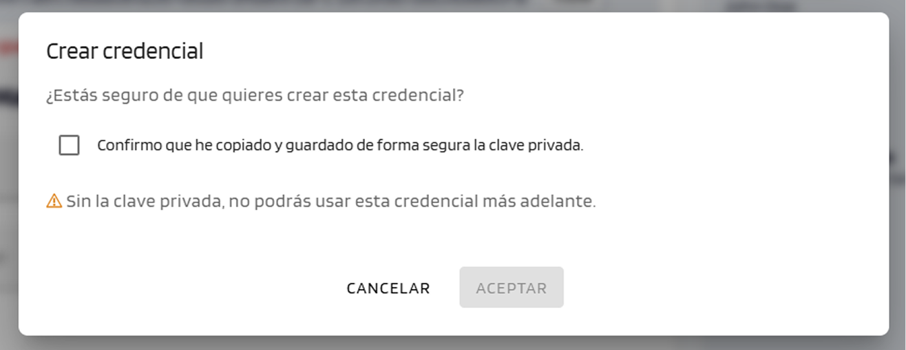

# Issue a credential

Steps to issue a credential from the Issuer Portal. The portal offers two methods: the standard one, available to any user, and an advanced one reserved for admins to issue on behalf of another organization.

| Method | Who can use it? | Organization representative |
|---|---|---|
| **New Credential** | Any portal user | Taken automatically from the logged-in user |
| **New Credential (on behalf of)** | Portal admins only | Entered manually; allows issuing on behalf of another organization |

---

## Steps — New Credential

??? "1. Log in"
    Log in to the Issuer Portal with the organizational credential.

    → See [Present credentials](../../users/wallet-eudiw/present-credentials.md)

??? "2. Click *New Credential*"
    After logging in, the portal shows the table of issued credentials. Click the **New Credential** button to start the issuance process.

    { width="640" }

??? "3. Select the credential type"
    Select the type of credential to issue (depends on the catalog configured for the organization).

    { width="240" }

    === "LEAR Credential Employee"
        Credential issued to a **person** (an employee of the organization). It allows them to identify themselves and prove their powers or roles within the organization to external services.

        **When to use it:** when you want to grant access to or accredit a specific employee.

        **Required recipient data:** first name, last name, email and employee number.

    === "LEAR Credential Machine"
        Credential issued to a **machine, service or application** (not to a person). It allows a system to identify itself automatically to other services.

        **When to use it:** when you want to accredit a service or application of the organization.

        **Required data:** the service domain and, optionally, an IP address.

??? "4. Select format, grant type and delivery method"
    The portal shows the issuance form. Three options are configured at the top:

    { width="640" }

    === "Credential format"
        The format determines how the credential is structured and protected.

        - **W3C VC Data Model v2.0** — Standard format and the most compatible with external services.
        - **SD-JWT VC** — Lets the holder show only the necessary data in each presentation, without revealing the rest. Recommended when data privacy is a priority.
           
            → For more technical information about this format, see [SD-JWT VC](../../developers/concepts/sd-jwt-vc.md).

    === "Grant type"
        The main difference is whether a PIN is required to accept the credential.

        - **Authorization Code** — The recipient accepts the credential directly from the email or QR code.
        - **Pre-Authorized Code** — The recipient receives a PIN by email after logging in to the wallet, and must enter it to accept the credential.

    === "Delivery method"
        How the offer is delivered to the recipient. The offer expires after **10 minutes**.

        - **Email** — An email with the offer is sent.
        - **QR code** — The portal displays a QR code on screen.

??? "5. Fill in the recipient data"
    The fields vary depending on the selected credential type. The **Mandator** (organization representative) data is shown automatically in the right-hand panel and is not editable.

    === "LEAR Credential Employee"
        Fill in the **Mandatee** fields and select at least one power in the **Powers** section.

        { width="640" }

        ??? info "Available powers"
            Powers may vary by organization. The following are some examples.

            | Function | Actions | Description |
            |---|---|---|
            | **Onboarding** | Execute | Allows managing the onboarding process for new participants. |
            | **Product offering** | Create, Update, Delete | Allows creating, modifying and deleting product or service offerings. |
            | **Certification** | Upload, Attest | Allows uploading and attesting certifications on behalf of the organization. |

    === "LEAR Credential Machine"
        Before filling in the data, generate the private key by clicking **Generate key** in the **Private key** section. This step is mandatory in order to create the credential.

        Fill in the **Mandatee** fields and select at least one power in the **Powers** section.

        { width="640" }

        ??? info "Available powers"
            Powers may vary by organization. The following are some examples.

            | Function | Actions | Description |
            |---|---|---|
            | **Onboarding** | Execute | Allows managing the onboarding process for new participants. |
            | **Product offering** | Create, Update, Delete | Allows creating, modifying and deleting product or service offerings. |
            | **Certification** | Upload, Attest | Allows uploading and attesting certifications on behalf of the organization. |

        ??? warning "Save the private key before continuing"
            When confirming the creation, the portal asks you to check the box **"I confirm that I have securely copied and saved the private key"**. Without it, it will not be possible to use the credential later.

            { width="480" }

??? "6. Confirm and create"
    Click the **Create Credential** button.

    { width="320" }

    The portal shows a confirmation dialog. Click **Accept** to complete the issuance.

    { width="320" }

    The result varies depending on the selected delivery method:

    - **Email**: the recipient receives the email with the credential offer.

        { width="320" }

    - **QR code**: the portal shows a dialog with the QR code and a *Copy link* button. The recipient scans the QR code with the wallet or pastes the link manually.

        { width="320" }

??? info "Check the status in the list"
    The newly created credential appears at the top of the list of issued credentials with the **DRAFT** status.

    { width="640" }

    The status is **DRAFT** until the recipient accepts the credential in their wallet, at which point it automatically becomes **VALID**.

    → See [Manage issuances](manage-issuances.md#statuses-during-the-issuance-flow)

---

## Steps — New Credential (on behalf of)

**Available only to portal admins.**

??? "1. Log in"
    Log in to the Issuer Portal with the organizational credential.

    → See [Present credentials](../../users/wallet-eudiw/present-credentials.md)

??? "2. Click *New Credential (on behalf of)*"
    After logging in, the portal shows the table of issued credentials. Click the **New Credential (on behalf of)** button to start the issuance process.

    { width="640" }

??? "3. Select the credential type"
    Select the type of credential to issue (depends on the catalog configured for the organization).

    { width="240" }

    === "LEAR Credential Employee"
        Credential issued to a **person** (an employee of the organization). It allows them to identify themselves and prove their powers or roles within the organization to external services.

        **When to use it:** when you want to grant access to or accredit a specific employee.

        **Required recipient data:** first name, last name, email and employee number.

    === "LEAR Credential Machine"
        Credential issued to a **machine, service or application** (not to a person). It allows a system to identify itself automatically to other services.

        **When to use it:** when you want to accredit a service or application of the organization.

        **Required data:** the service domain and, optionally, an IP address.

??? "4. Select format, grant type and delivery method"
    The portal shows the issuance form. Three options are configured at the top:

    { width="640" }

    === "Credential format"
        The format determines how the credential is structured and protected.

        - **W3C VC Data Model v2.0** — Standard format and the most compatible with external services.
        - **SD-JWT VC** — Lets the holder show only the necessary data in each presentation, without revealing the rest. Recommended when data privacy is a priority. 
  
            → For more technical information about this format, see [SD-JWT VC](../../developers/concepts/sd-jwt-vc.md).

    === "Grant type"
        The main difference is whether a PIN is required to accept the credential.

        - **Authorization Code** — The recipient accepts the credential directly from the email or QR code.
        - **Pre-Authorized Code** — The recipient receives a PIN by email after logging in to the wallet, and must enter it to accept the credential.

    === "Delivery method"
        How the offer is delivered to the recipient. The offer expires after **10 minutes**.

        - **Email** — An email with the offer is sent.
        - **QR code** — The portal displays a QR code on screen.

??? "5. Fill in the mandator and recipient data"
    Unlike the standard method, the **Mandator** section is not filled in automatically: you must manually enter the data of the issuing organization's representative.

    === "LEAR Credential Employee"
        Fill in the **Mandatee** fields, the **Mandator** fields and select at least one power in the **Powers** section.

        { width="640" }

        ??? info "Available powers"
            Powers may vary by organization. The following are some examples.

            | Function | Actions | Description |
            |---|---|---|
            | **Onboarding** | Execute | Allows managing the onboarding process for new participants. |
            | **Product offering** | Create, Update, Delete | Allows creating, modifying and deleting product or service offerings. |
            | **Certification** | Upload, Attest | Allows uploading and attesting certifications on behalf of the organization. |

    === "LEAR Credential Machine"
        Before filling in the data, generate the private key by clicking **Generate key** in the **Private key** section. This step is mandatory in order to create the credential.

        Fill in the **Mandatee** fields, the **Mandator** fields and select at least one power in the **Powers** section.

        { width="640" }

        ??? info "Available powers"
            Powers may vary by organization. The following are some examples.

            | Function | Actions | Description |
            |---|---|---|
            | **Onboarding** | Execute | Allows managing the onboarding process for new participants. |
            | **Product offering** | Create, Update, Delete | Allows creating, modifying and deleting product or service offerings. |
            | **Certification** | Upload, Attest | Allows uploading and attesting certifications on behalf of the organization. |

        ??? warning "Save the private key before continuing"
            When confirming the creation, the portal asks you to check the box **"I confirm that I have securely copied and saved the private key"**. Without it, it will not be possible to use the credential later.

            { width="480" }

??? "6. Confirm and create"
    Click the **Create Credential** button.

    { width="320" }

    The portal shows a confirmation dialog. Click **Accept** to complete the issuance.

    { width="320" }

    The result varies depending on the selected delivery method:

    - **Email**: the recipient receives the email with the credential offer.

        { width="320" }

    - **QR code**: the portal shows a dialog with the QR code and a *Copy link* button. The recipient scans the QR code with the wallet or pastes the link manually.

        { width="320" }

??? info  "Check the status in the list"
    The newly created credential appears at the top of the list of issued credentials with the **DRAFT** status.

    { width="640" }

    The status is **DRAFT** until the recipient accepts the credential in their wallet, at which point it automatically becomes **VALID**.

    → See [Manage issuances](manage-issuances.md#statuses-during-the-issuance-flow)

---

## Check the status of issuances

To check the possible statuses of a credential, see [Manage issuances → Issuance statuses](manage-issuances.md#statuses-during-the-issuance-flow).
