# Emitir una credencial

Pasos para emitir una credencial desde el Portal Issuer. El portal ofrece dos métodos: el estándar, disponible para cualquier usuario, y uno avanzado reservado a administradores para emitir en nombre de otra organización.

| Método | ¿Quién puede usarlo? | Representante de la organización |
|---|---|---|
| **Nueva Credencial** | Cualquier usuario del portal | Se toma automáticamente del usuario que ha iniciado sesión |
| **Nueva Credencial (en nombre de)** | Solo administradores del portal | Se introduce manualmente; permite emitir en nombre de otra organización |

---

## Pasos — Nueva Credencial

??? "1. Iniciar sesión"
    Iniciar sesión en el Portal Issuer con la credencial organizativa.

    → Ver [Presentar credenciales](../../users/wallet-eudiw/present-credentials.md)

??? "2. Pulsar *Nueva Credencial*"
    Tras el acceso, el portal muestra la tabla de credenciales emitidas. Pulsar el botón **Nueva Credencial** para iniciar el proceso de emisión.

    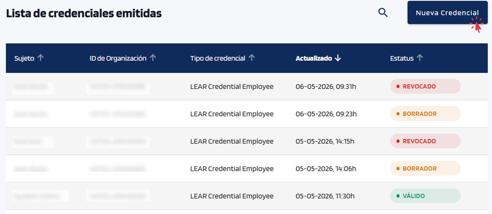{ width="640" }

??? "3. Seleccionar el tipo de credencial"
    Seleccionar el tipo de credencial a emitir (depende del catálogo configurado para la organización).

    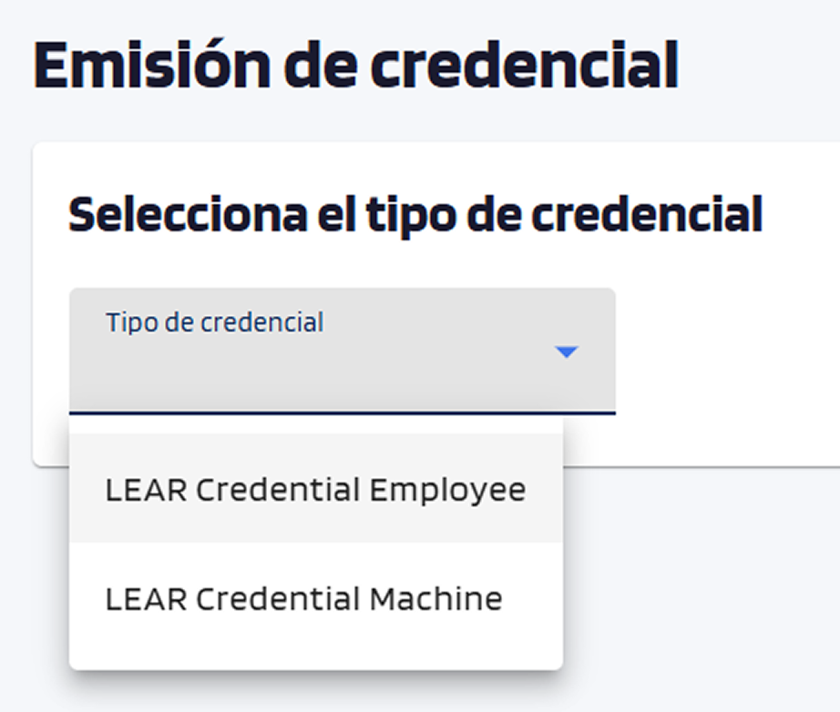{ width="240" }

    === "LEAR Credential Employee"
        Credencial emitida a una **persona** (empleado de la organización). Le permite identificarse y acreditar sus poderes o funciones dentro de la organización ante servicios externos.

        **Cuándo usarla:** cuando se quiere dar acceso o acreditar a un empleado concreto.

        **Datos requeridos del destinatario:** nombre, apellidos, email y número de empleado.

    === "LEAR Credential Machine"
        Credencial emitida a una **máquina, servicio o aplicación** (no a una persona). Permite que un sistema se identifique de forma automática ante otros servicios.

        **Cuándo usarla:** cuando se quiere acreditar un servicio o aplicación de la organización.

        **Datos requeridos:** dominio del servicio y, opcionalmente, dirección IP.

??? "4. Seleccionar formato, tipo de concesión y método de entrega"
    El portal muestra el formulario de emisión. En la parte superior se configuran tres opciones:

    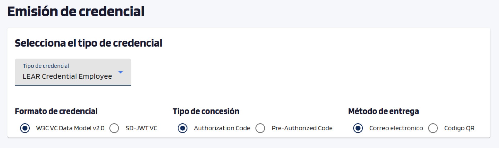{ width="640" }

    === "Formato de credencial"
        El formato determina cómo se estructura y protege la credencial.

        - **W3C VC Data Model v2.0** — Formato estándar y el más compatible con servicios externos. Recomendado para la mayoría de los casos.
        - **SD-JWT VC** — Permite al titular mostrar solo los datos necesarios en cada presentación, sin revelar el resto. Recomendado cuando la privacidad de los datos es prioritaria.

    === "Tipo de concesión"
        La principal diferencia es si se requiere un PIN para aceptar la credencial.

        - **Authorization Code** — El destinatario acepta la credencial directamente desde el email o QR.
        - **Pre-Authorized Code** — El destinatario recibe un PIN por email tras iniciar sesión en el wallet, y debe introducirlo para aceptar la credencial.

    === "Método de entrega"
        Cómo se hace llegar la oferta al destinatario. La oferta caduca a los **10 minutos**.

        - **Correo electrónico** — Se envía un email con la oferta.
        - **Código QR** — El portal muestra un código QR en pantalla.

??? "5. Rellenar los datos del destinatario"
    Los campos varían según el tipo de credencial seleccionado. Los datos del **Mandante** (representante de la organización) se muestran en el panel derecho de forma automática y no son editables.

    === "LEAR Credential Employee"
        Rellenar los campos de **Persona Mandatada** y seleccionar al menos un poder en la sección **Poderes**.

        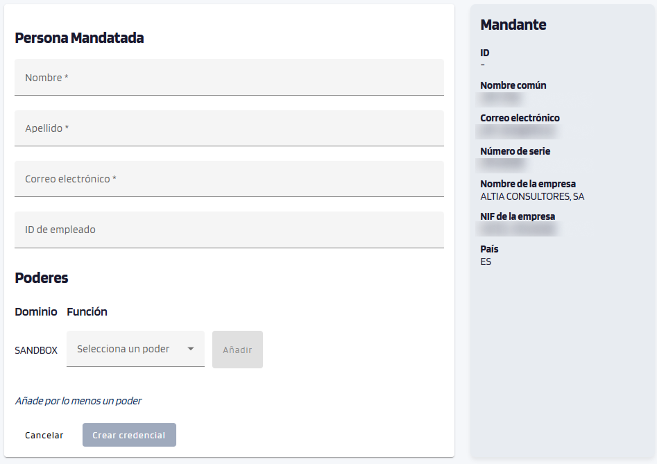{ width="640" }

        ??? info "Poderes disponibles"
            | Función | Acciones | Descripción |
            |---|---|---|
            | **Alta** | Ejecutar | Permite gestionar el proceso de incorporación de nuevos participantes. |
            | **Oferta de producto** | Crear, Actualizar, Eliminar | Permite crear, modificar y eliminar ofertas de productos o servicios. |
            | **Certificación** | Subir, Acreditar | Permite subir y acreditar certificaciones en nombre de la organización. |

    === "LEAR Credential Machine"
        Antes de rellenar los datos, generar la llave privada pulsando **Generar llave** en la sección **Llave privada**. Este paso es obligatorio para poder crear la credencial.

        Rellenar los campos de **Persona Mandatada** y seleccionar al menos un poder en la sección **Poderes**.

        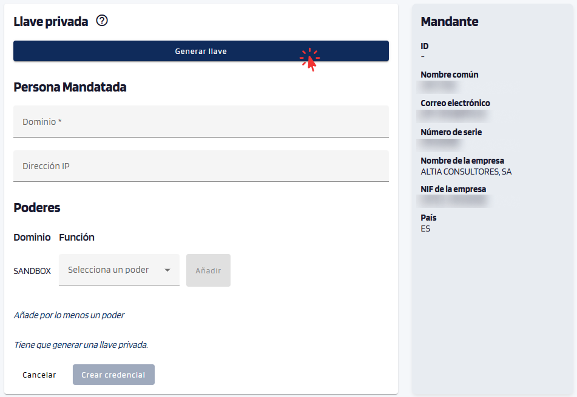{ width="640" }

        ??? info "Poderes disponibles"
            | Función | Acciones | Descripción |
            |---|---|---|
            | **Alta** | Ejecutar | Permite gestionar el proceso de incorporación de nuevos participantes. |
            | **Oferta de producto** | Crear, Actualizar, Eliminar | Permite crear, modificar y eliminar ofertas de productos o servicios. |
            | **Certificación** | Subir, Acreditar | Permite subir y acreditar certificaciones en nombre de la organización. |

??? "6. Confirmar y crear"
    Pulsar el botón **Crear Credencial**.

    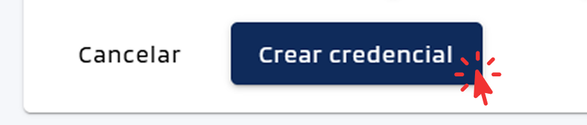{ width="320" }

    El portal muestra un diálogo de confirmación. Pulsar **Aceptar** para completar la emisión.

    { width="320" }

    El resultado varía según el método de entrega seleccionado:

    - **Correo electrónico**: el destinatario recibe el correo con la oferta de credencial.

        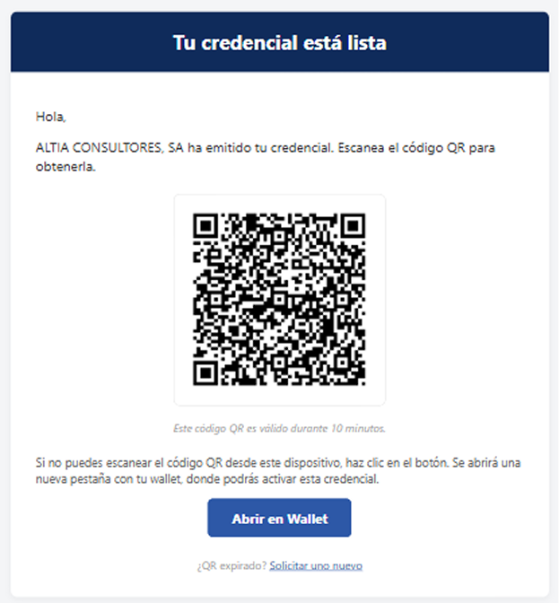{ width="320" }

    - **Código QR**: el portal muestra un diálogo con el código QR y un botón *Copiar enlace*. El destinatario escanea el QR con el wallet o pega el enlace manualmente.

        { width="320" }

??? info "Comprobar el estado en la lista"
    La credencial recién creada aparece en la parte superior de la lista de credenciales emitidas con el estado **BORRADOR**.

    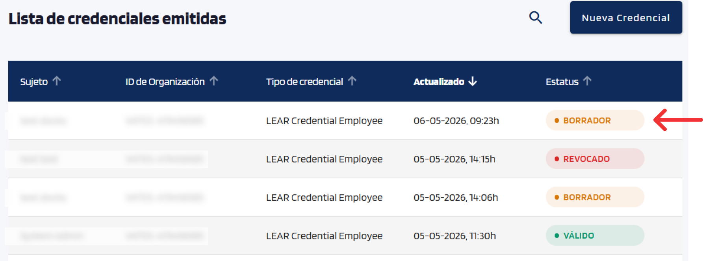{ width="640" }

    El estado es **BORRADOR** hasta que el destinatario acepta la credencial en su wallet, momento en que pasa a **VÁLIDO** automáticamente.

    → Ver [Gestionar emisiones](manage-issuances.md#estados-durante-el-flujo-de-emision)

---

## Pasos — Nueva Credencial (en nombre de)

**Disponible únicamente para administradores del portal.**

??? "1. Iniciar sesión"
    Iniciar sesión en el Portal Issuer con la credencial organizativa.

    → Ver [Presentar credenciales](../../users/wallet-eudiw/present-credentials.md)

??? "2. Pulsar *Nueva Credencial (en nombre de)*"
    Tras el acceso, el portal muestra la tabla de credenciales emitidas. Pulsar el botón **Nueva Credencial (en nombre de)** para iniciar el proceso de emisión.

    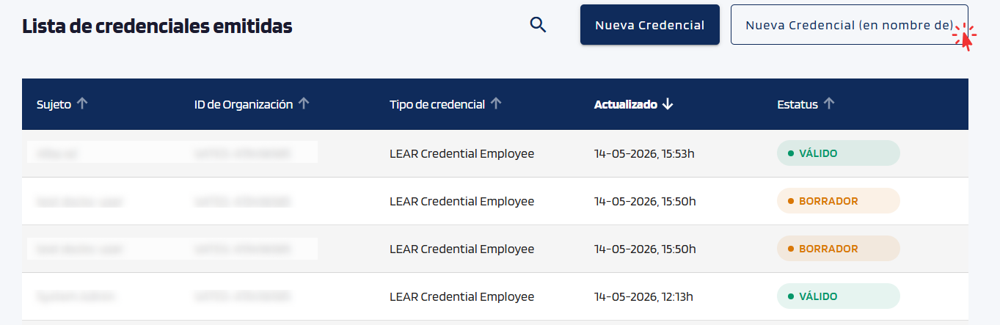{ width="640" }

??? "3. Seleccionar el tipo de credencial"
    Seleccionar el tipo de credencial a emitir (depende del catálogo configurado para la organización).

    { width="240" }

    === "LEAR Credential Employee"
        Credencial emitida a una **persona** (empleado de la organización). Le permite identificarse y acreditar sus poderes o funciones dentro de la organización ante servicios externos.

        **Cuándo usarla:** cuando se quiere dar acceso o acreditar a un empleado concreto.

        **Datos requeridos del destinatario:** nombre, apellidos, email y número de empleado.

    === "LEAR Credential Machine"
        Credencial emitida a una **máquina, servicio o aplicación** (no a una persona). Permite que un sistema se identifique de forma automática ante otros servicios.

        **Cuándo usarla:** cuando se quiere acreditar un servicio o aplicación de la organización.

        **Datos requeridos:** dominio del servicio y, opcionalmente, dirección IP.

??? "4. Seleccionar formato, tipo de concesión y método de entrega"
    El portal muestra el formulario de emisión. En la parte superior se configuran tres opciones:

    { width="640" }

    === "Formato de credencial"
        El formato determina cómo se estructura y protege la credencial.

        - **W3C VC Data Model v2.0** — Formato estándar y el más compatible con servicios externos. Recomendado para la mayoría de los casos.
        - **SD-JWT VC** — Permite al titular mostrar solo los datos necesarios en cada presentación, sin revelar el resto. Recomendado cuando la privacidad de los datos es prioritaria.

    === "Tipo de concesión"
        La principal diferencia es si se requiere un PIN para aceptar la credencial.

        - **Authorization Code** — El destinatario acepta la credencial directamente desde el email o QR.
        - **Pre-Authorized Code** — El destinatario recibe un PIN por email tras iniciar sesión en el wallet, y debe introducirlo para aceptar la credencial.

    === "Método de entrega"
        Cómo se hace llegar la oferta al destinatario. La oferta caduca a los **10 minutos**.

        - **Correo electrónico** — Se envía un email con la oferta.
        - **Código QR** — El portal muestra un código QR en pantalla.

??? "5. Rellenar los datos del mandante y del destinatario"
    A diferencia del método estándar, la sección **Mandante** no se rellena automáticamente: es necesario introducir manualmente los datos del representante de la organización emisora.

    === "LEAR Credential Employee"
        Rellenar los campos de **Persona Mandatada**, los campos de **Mandante** y seleccionar al menos un poder en la sección **Poderes**.

        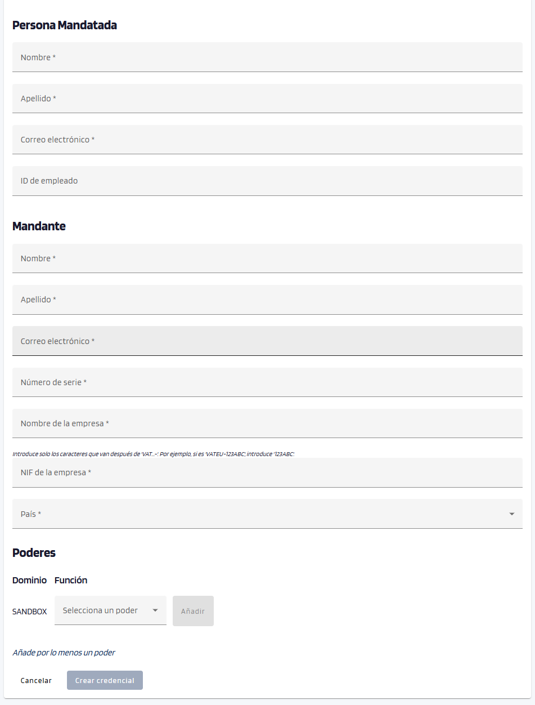{ width="640" }

        ??? info "Poderes disponibles"
            | Función | Acciones | Descripción |
            |---|---|---|
            | **Alta** | Ejecutar | Permite gestionar el proceso de incorporación de nuevos participantes. |
            | **Oferta de producto** | Crear, Actualizar, Eliminar | Permite crear, modificar y eliminar ofertas de productos o servicios. |
            | **Certificación** | Subir, Acreditar | Permite subir y acreditar certificaciones en nombre de la organización. |

    === "LEAR Credential Machine"
        Antes de rellenar los datos, generar la llave privada pulsando **Generar llave** en la sección **Llave privada**. Este paso es obligatorio para poder crear la credencial.

        Rellenar los campos de **Persona Mandatada**, los campos de **Mandante** y seleccionar al menos un poder en la sección **Poderes**.

        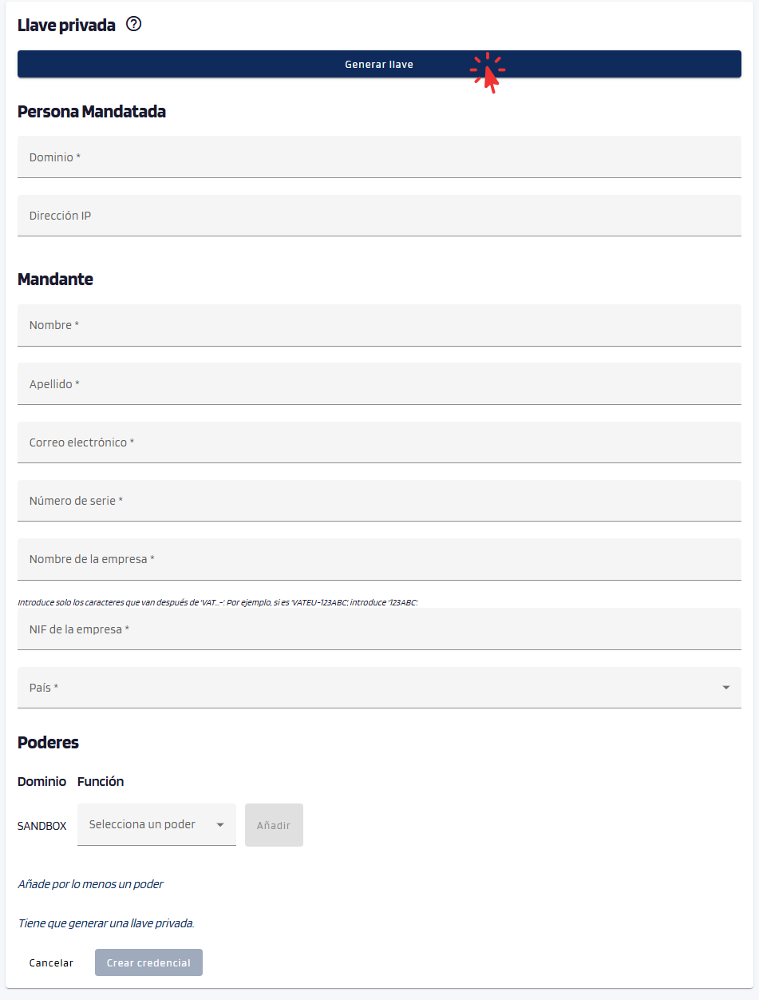{ width="640" }

        ??? info "Poderes disponibles"
            | Función | Acciones | Descripción |
            |---|---|---|
            | **Alta** | Ejecutar | Permite gestionar el proceso de incorporación de nuevos participantes. |
            | **Oferta de producto** | Crear, Actualizar, Eliminar | Permite crear, modificar y eliminar ofertas de productos o servicios. |
            | **Certificación** | Subir, Acreditar | Permite subir y acreditar certificaciones en nombre de la organización. |

??? "6. Confirmar y crear"
    Pulsar el botón **Crear Credencial**.

    { width="320" }

    El portal muestra un diálogo de confirmación. Pulsar **Aceptar** para completar la emisión.

    { width="320" }

    El resultado varía según el método de entrega seleccionado:

    - **Correo electrónico**: el destinatario recibe el correo con la oferta de credencial.

        { width="320" }

    - **Código QR**: el portal muestra un diálogo con el código QR y un botón *Copiar enlace*. El destinatario escanea el QR con el wallet o pega el enlace manualmente.

        { width="320" }

??? info  "Comprobar el estado en la lista"
    La credencial recién creada aparece en la parte superior de la lista de credenciales emitidas con el estado **BORRADOR**.

    { width="640" }

    El estado es **BORRADOR** hasta que el destinatario acepta la credencial en su wallet, momento en que pasa a **VÁLIDO** automáticamente.

    → Ver [Gestionar emisiones](manage-issuances.md#estados-durante-el-flujo-de-emision)

---

## Consultar el estado de las emisiones

Para consultar los posibles estados de una credencial, ver [Gestionar emisiones → Estados de las emisiones](manage-issuances.md#estados-durante-el-flujo-de-emision).
