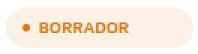
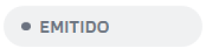
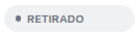
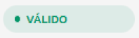
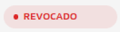
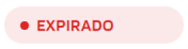
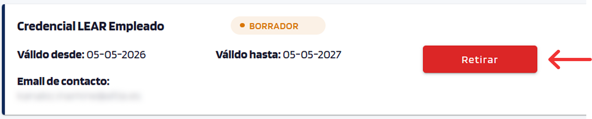

# Manage issuances

Consult and operate on already issued credentials.

---

## List of issued credentials

??? "View list"
    The management screen lists all launched issuances with:

    - Subject (recipient).
    - Credential type.
    - Last update.
    - Status (DRAFT / VALID / EXPIRED / WITHDRAWN / REVOKED).

    { width="640" }

    Click a row in the table to access the [detail of that issuance](#credential-details).

---

## Credential details

??? "View detail"
    Accessible by clicking any row in the [list of issued credentials](#list-of-issued-credentials).

    It shows all the information of the selected credential: attributes, current status, issuance and expiry dates, and history of status changes.

    { width="640" }

    !!! note "Issuer and Credential status sections"
        The **Issuer** and **Credential status** sections appear only when the recipient has accepted the credential from their wallet.

---

## Statuses during the issuance flow

??? "View statuses"
    The status of each issuance is visible both in the list table and on the credential detail screen. Each status determines which actions are available; see the [Actions](#actions) section for more information.

    - { width="120" style="vertical-align: middle;" }: offer sent, not yet accepted by the recipient.
    - { width="120" style="vertical-align: middle;" }: the recipient has accepted the credential but its validity period has not started yet.
    - { width="120" style="vertical-align: middle;" }: the issuer has cancelled the offer before the recipient accepted it.
    - { width="120" style="vertical-align: middle;" }: the recipient has accepted the credential and it is in their wallet within its validity period.
    - { width="120" style="vertical-align: middle;" }: the issuer has explicitly revoked the credential; it stops being valid even if it has not reached its expiry date.
    - { width="120" style="vertical-align: middle;" }: the credential has passed its validity date.

---

## Actions

??? "View actions"
    Actions are performed from the credential detail screen. Only some actions are available depending on the issuance status.

    - **Withdraw**: the button for this action appears when the credential is in **DRAFT** status. It cancels the offer before the recipient accepts it. If the offer did not arrive or some data is incorrect, withdraw the current issuance and issue a new credential with the correct data.

        { width="560" }

    - **Revoke**: the button for this action appears when the credential is in **VALID** status. It marks the credential as revoked in the public Status List (any verifier will be able to check it).

        { width="560" }
