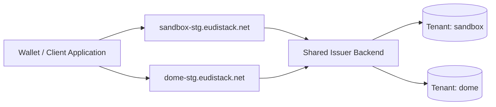

# Multi-tenant

EUDIStack is a **multi-tenant** platform: each customer organization operates as an isolated tenant with its own configuration, branding, cryptographic credentials and dedicated resources.

Multi-tenant isolation allows multiple organizations to share the same EUDIStack infrastructure without mixing data, identities or configurations.

---

## Multi-tenant architecture

EUDIStack frontend and backend components automatically identify the tenant from the domain used in each request.

---

## Tenant identification

The tenant is automatically resolved from the request **subdomain**. Your integration does not need to explicitly send the tenant in headers or parameters.

??? example "Tenant resolution examples"
    | URL | Resolved tenant |
    |---|---|
    | `sandbox-stg.eudistack.net` | `sandbox` |
    | `dome-stg.eudistack.net` | `dome` |
    | `kpmg-stg.eudistack.net` | `kpmg` |

---

## Resource isolation

??? info "Isolation table"
    | Resource | Isolation |
    |---|---|
    | Database | Dedicated PostgreSQL schema (`schema-per-tenant`). |
    | Frontends (Wallet, Portal) | Dedicated deployment/distribution with tenant-specific branding. |
    | Backends (Issuer, Verifier, EBW) | **Shared**, tenant identified through the `Host` header. |
    | Cryptographic keys | Independent per tenant. |
    | Status Lists | Tenant-specific URLs. |

---

## Implications for integrators

??? warning "What you need to keep in mind"
    - **Cross-tenant access is not possible**: a credential issued in tenant A cannot be received or managed by a wallet from tenant B (same-origin isolation applies).
    - **One integration per tenant**: if you work with multiple tenants, configure a separate client for each one.
    - **Branding**: each tenant has its own logo, color palette and naming across wallets, portals and emails. Branding is transparent to the technical integration.
    - **Security**: shared backends never mix tenant data, and all operations are executed within the tenant context resolved from the incoming domain.
