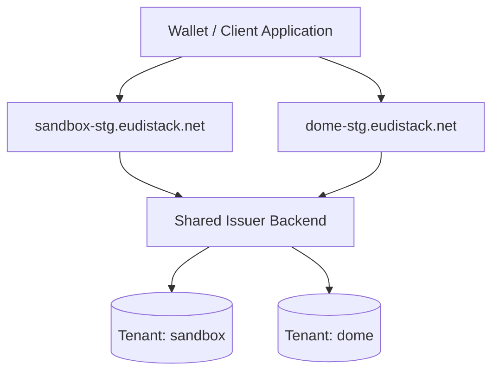

# Multi-tenant

EUDIStack es una plataforma **multi-tenant**: cada organización cliente opera como un tenant aislado con su propia configuración, branding, credenciales criptográficas y recursos dedicados.

El aislamiento multi-tenant permite que múltiples organizaciones compartan la misma infraestructura EUDIStack sin mezclar datos, identidades ni configuraciones.

## Arquitectura multi-tenant

Los componentes frontend y backend de EUDIStack distinguen automáticamente el tenant a partir del dominio utilizado en cada request.

## Aislamiento por tenant

| Recurso | Aislamiento                                           |
|---|-------------------------------------------------------|
| Base de datos | Schema dedicado en PostgreSQL (`schema-per-tenant`).  |
| Frontends (Wallet, Portal) | Despliegue/distribución dedicada con branding propio. |
| Backends (Issuer, Verifier, EBW) | **Compartidos**, distinguen tenant por `Host` header. |
| Claves criptográficas | Independientes por tenant.                            |
| Status Lists | URLs propias por tenant.                              |

## Identificación del tenant

El tenant se resuelve automáticamente a partir del **subdominio** de la petición.

### Ejemplos:

- `sandbox-stg.eudistack.net` → tenant `sandbox`.
- `dome-stg.eudistack.net` → tenant `dome`.
- `kpmg-stg.eudistack.net` → tenant `kpmg`.

Tu integración no necesita pasar el tenant explícitamente en headers ni parámetros: viene implícito en la URL utilizada.

## Implicaciones para integradores

- **Cross-tenant no es posible**: una credencial emitida en tenant A no la puede recibir un wallet del tenant B (mismo origen requerido).
- **Una integración por tenant**: si trabajas con varios tenants, configura un cliente por cada uno.
- **Branding**: cada tenant ve su logo, paleta y nombres en wallet, portales y emails. La identidad es transparente para tu integración.
- **Seguridad**: los backends compartidos nunca mezclan datos entre tenants y todas las operaciones se ejecutan dentro del contexto resuelto desde el dominio de entrada.

