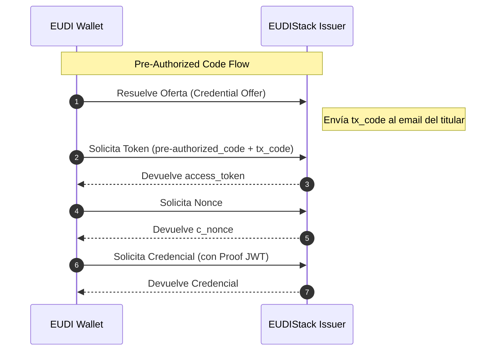
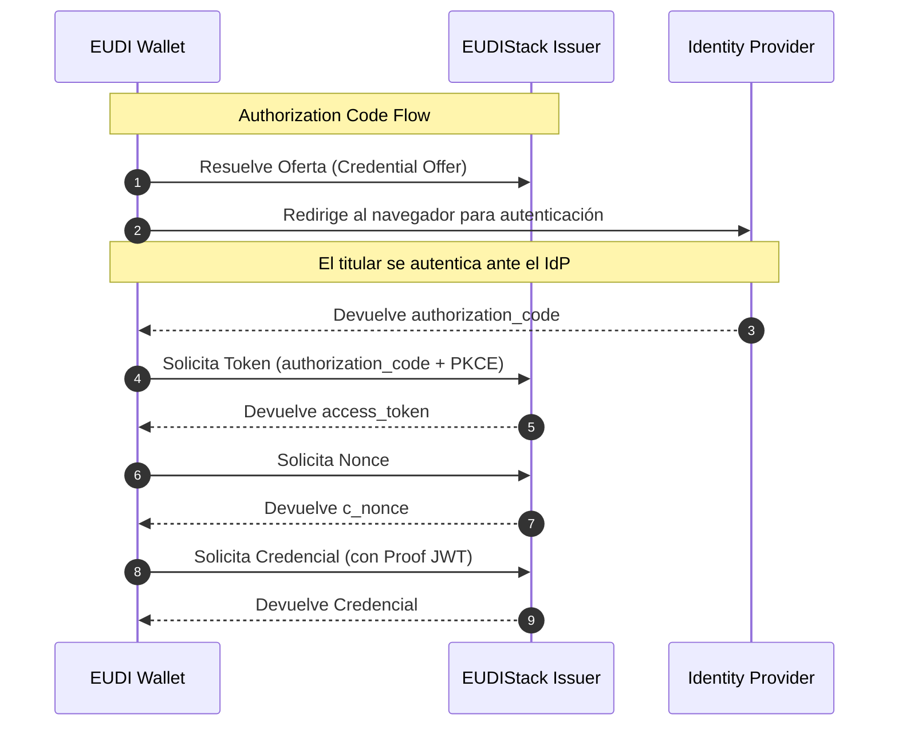

# OID4VCI — OpenID for Verifiable Credential Issuance

OID4VCI es el protocolo estándar (basado en OAuth 2.0) que define el mecanismo mediante el cual un Issuer entrega una credencial verificable a un wallet. EUDIStack implementa este protocolo para la emisión de credenciales.

Los formatos de credencial soportados de forma nativa son **jwt_vc_json** y **SD-JWT VC**.

---

## Flujos de emisión

El estándar OID4VCI define dos flujos para la emisión de credenciales. La implementación de EUDIStack soporta ambos; la selección del flujo adecuado depende del caso de uso de cada organización.

### Pre-Authorized Code Flow

Este flujo está orientado a escenarios en los que el Issuer dispone previamente de los datos del titular.
El Issuer genera una oferta que contiene un código de autorización preautorizado. Para mitigar el riesgo asociado a la interceptación de la oferta, la implementación de EUDIStack aplica de forma sistemática un código de transacción de 6 dígitos en modo numérico.


En el momento en que el wallet resuelve la URL de la oferta, el sistema envía automáticamente el **código de transacción** al correo electrónico del titular. Dicho código deberá ser introducido por el titular en el wallet para validar el acceso al proceso de emisión.
Tras la validación del código, el wallet canjea el **pre-authorized_code** junto con el **tx_code** para obtener el token de acceso.



### Authorization Code Flow

Este flujo corresponde al mecanismo OAuth 2.0 estándar. Se aplica en escenarios de autoservicio, en los que el titular inicia el proceso de forma explícita a través de un portal y se autentica ante el Identity Provider (IdP) antes de recibir la credencial.

En este flujo el wallet abre un navegador integrado, redirige al titular hacia el **IdP** y, tras una autenticación exitosa, recibe el **authorization_code** para canjearlo por el token de acceso.




---

## Anatomía de una Oferta

Para iniciar cualquiera de los dos flujos, el wallet necesita resolver una URL de oferta. El JSON al que apunta dicha URL tiene la siguiente estructura:

### Pre-Authorized Offer

```json
{
  "credential_issuer": "https://issuer.sandbox.eudistack.net",
  "credential_configuration_ids": [
    "learcredential.employee.w3c.4"
  ],
  "grants": {
    "urn:ietf:params:oauth:grant-type:pre-authorized_code": {
      "pre-authorized_code": "oaKazRN8I0IbtZ0C7JuMn5",
      "tx_code": {
        "length": 6,
        "input_mode": "numeric",
        "description": "Enter the activation code"
      }
    }
  }
}
```
### Authorization Offer

```json
{
  "credential_issuer": "https://issuer.sandbox.eudistack.net",
  "credential_configuration_ids": [
    "learcredential.employee.w3c.4"
  ],
  "grants": {
    "authorization_code": {
      "issuer_state": "eyJhbGciOiJSUzI1NiIsInR5cCI6IkpXVCJ9..."
    }
  }
}
```

---

## Referencias

* **Referencia API:** [Endpoints Issuer](../api-reference/issuer.md)
* **Especificación Oficial:** [OID4VCI 1.0](https://openid.net/specs/openid-4-verifiable-credential-issuance-1_0.html)
* **Perfil HAIP:** [Estándares](../../reference/standards.md)