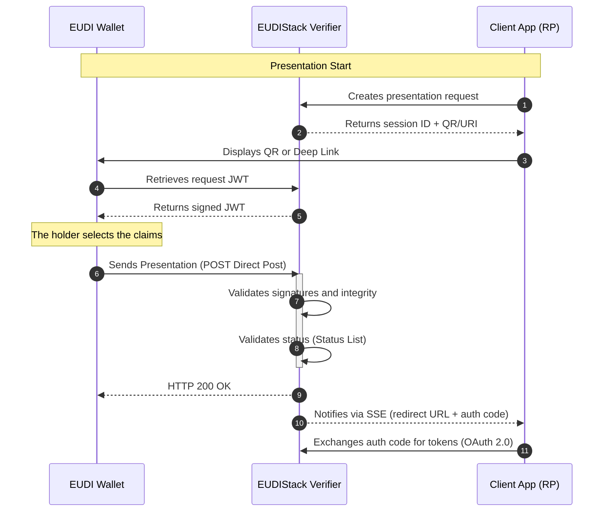

# OID4VP — OpenID for Verifiable Presentations

OID4VP is the standard protocol that defines how a Verifier requests and receives verifiable credential presentations from a wallet. The EUDIStack implementation acts as the verifier component, allowing third-party applications to consume identity data securely and in a standardized way.

The supported credential formats for verification include **jwt_vc_json** and **SD-JWT VC**.

---

## Presentation flows

The implementation supports flows adapted to different interaction contexts between the holder and the verifying entity:

- **Cross-device (QR)** — The holder interacts with a web application on one device and uses the wallet on another to scan a QR code and initiate the presentation.
- **Direct Post** — A mechanism through which the wallet sends the presentation directly to the verifier's endpoint via an HTTP POST request, ensuring the privacy and security of the exchange.

---

## Flow diagram

The presentation process is based on a coordinated interaction between the client application, the EUDIStack verifier component, and the user's wallet.
The sequence begins with the creation of a verification session and ends with the delivery of the validated claims to the requesting application after a complete check of signatures and revocation statuses.



---

## Anatomy of a Request

The central object of OID4VP is the presentation request. Below is an example of a JSON object that the wallet resolves when initiating the flow for an employee credential:

```json
{
  "iss": "did:key:z6Mk...",
  "aud": "[https://self-issued.me/v2](https://self-issued.me/v2)",
  "iat": 1746524400,
  "exp": 1746524700,
  "jti": "550e8400-e29b-41d4-a716-446655440000",
  "client_id": "did:key:z6Mk...",
  "nonce": "a4f8c2d1-3e7b-4a9d-b5f0-1c6e2a8d4f7b",
  "response_uri": "[https://verifier.example.com/oid4vp/auth-response](https://verifier.example.com/oid4vp/auth-response)",
  "scope": "openid learcredential.employee",
  "state": "9f3b1c2a-7e4d-48a5-b0f2-3d6c8e1a5b9f",
  "response_type": "vp_token",
  "response_mode": "direct_post",
  "dcql_query": {
    "credentials": [
      {
        "id": "lear_employee_sd_jwt",
        "format": "dc+sd-jwt",
        "meta": {
          "vct_values": ["eu.europa.ec.eudi.lce.1"]
        }
      }
    ]
  },
  "client_metadata": {
    "vp_formats_supported": {
      "dc+sd-jwt": {
        "sd-jwt_alg_values": ["ES256"],
        "kb-jwt_alg_values": ["ES256"]
      },
      "jwt_vc_json": {
        "alg_values_supported": ["ES256"]
      }
    }
  }
}
```

---

## References

* **Official Specification:** [OID4VP 1.0](https://openid.net/specs/openid-4-verifiable-presentations-1_0.html)
* **Credential Query:** [Digital Credential Query Language (DCQL)](https://openid.net/specs/openid-4-verifiable-presentations-1_0.html#section-dcql)
* **API Reference:** [Verifier Endpoints](../api-reference/verifier.md)