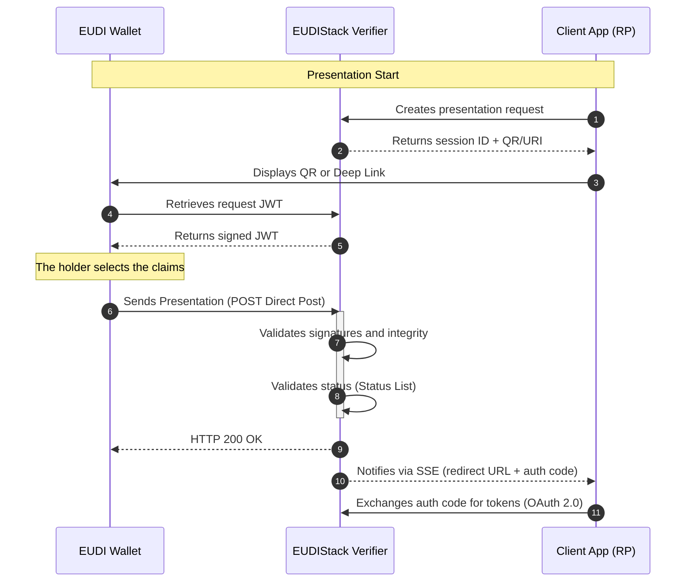

# OID4VP — OpenID for Verifiable Presentations

OID4VP is the standard protocol that defines how a Verifier requests and receives verifiable credential presentations from a wallet. The EUDIStack implementation acts as the verifier component, allowing third-party applications to consume identity data securely and in a standardized way.

The supported credential formats for verification include **SD-JWT VC** (normative identifier: `dc+sd-jwt`) and **JWT VC** (identifier: `jwt_vc_json`).

---

## Presentation flows

The implementation supports flows adapted to different interaction contexts between the holder and the verifying entity:

=== "Cross-device (QR)"
    The holder interacts with a web application on one device and uses the wallet on another to scan a QR code and initiate the presentation.

    **Flow steps:**

    1. The client application requests the Verifier to create a presentation session.
    2. The Verifier returns a `session_id` and the authorization request URL (encoded as a QR code or deep link).
    3. The application displays the QR code to the user on the web device screen.
    4. The user scans the QR code with their EUDI wallet on a second device.
    5. The wallet downloads the request JWT (`POST /oid4vp/auth-request/{id}`) and submits the selected claims (`POST /oid4vp/auth-response`).
    6. The Verifier validates the presentation and notifies the application via SSE with the result.

=== "Direct Post"
    A mechanism through which the wallet sends the presentation directly to the verifier's endpoint via an HTTP POST request, ensuring the privacy and security of the exchange.

    **How it works:**

    - The `response_mode=direct_post` parameter in the request JWT tells the wallet to send the `vp_token` directly to the Verifier's `response_uri`, instead of including it in a redirect URL.
    - The wallet constructs the VP Token (SD-JWT string with the selected disclosures and the Key Binding JWT) and sends it via `POST` to the `response_uri` endpoint.
    - The Verifier checks signatures, key binding, and revocation status before notifying the client application.
    - This mode is the default used by EUDIStack for both cross-device and same-device flows.

---

## Flow diagram

The presentation process is based on a coordinated interaction between the client application, the EUDIStack verifier component, and the user's wallet.
The sequence begins with the creation of a verification session and ends with the delivery of the validated claims to the requesting application after a complete check of signatures and revocation statuses.



---

## Anatomy of a Request

??? note "Sample presentation request object"
    The central object of OID4VP is the presentation request. Below is an example of a JSON object that the wallet resolves when initiating the flow for an employee credential:

    > **Note on identifiers:** The `vct_values` field inside the DCQL query contains the Verifiable Credential Type, defined in the `vct` field of the issued credential (e.g., `eu.europa.ec.eudi.lce.1`). This value is different from the `credential_configuration_id` present in the issuance offer (OID4VCI), which is the configuration identifier in the Issuer's metadata.

    ```json
    {
      "iss": "did:key:z6Mk...",
      "aud": "[https://self-issued.me/v2](https://self-issued.me/v2)",
      "iat": 1746524400,
      "exp": 1746524700,
      "jti": "550e8400-e29b-41d4-a716-446655440000",
      "client_id": "did:key:z6Mk...",
      "nonce": "a4f8c2d1-3e7b-4a9d-b5f0-1c6e2a8d4f7b",
      "response_uri": "[https://verifier.example.com/oid4vp/auth-response](https://verifier.example.com/oid4vp/auth-response)",
      "scope": "openid learcredential.employee",
      "state": "9f3b1c2a-7e4d-48a5-b0f2-3d6c8e1a5b9f",
      "response_type": "vp_token",
      "response_mode": "direct_post",
      "dcql_query": {
        "credentials": [
          {
            "id": "lear_employee_sd_jwt",
            "format": "dc+sd-jwt",
            "meta": {
              "vct_values": ["eu.europa.ec.eudi.lce.1"]
            }
          }
        ]
      },
      "client_metadata": {
        "vp_formats_supported": {
          "dc+sd-jwt": {
            "sd-jwt_alg_values": ["ES256"],
            "kb-jwt_alg_values": ["ES256"]
          },
          "jwt_vc_json": {
            "alg_values_supported": ["ES256"]
          }
        }
      }
    }
    ```

---

## References

* **Official Specification:** [OID4VP 1.0](https://openid.net/specs/openid-4-verifiable-presentations-1_0.html)
* **Credential Query:** [Digital Credential Query Language (DCQL)](https://openid.net/specs/openid-4-verifiable-presentations-1_0.html#name-digital-credentials-query-l)
* **API Reference:** [Verifier Endpoints](../api-reference/verifier.md)