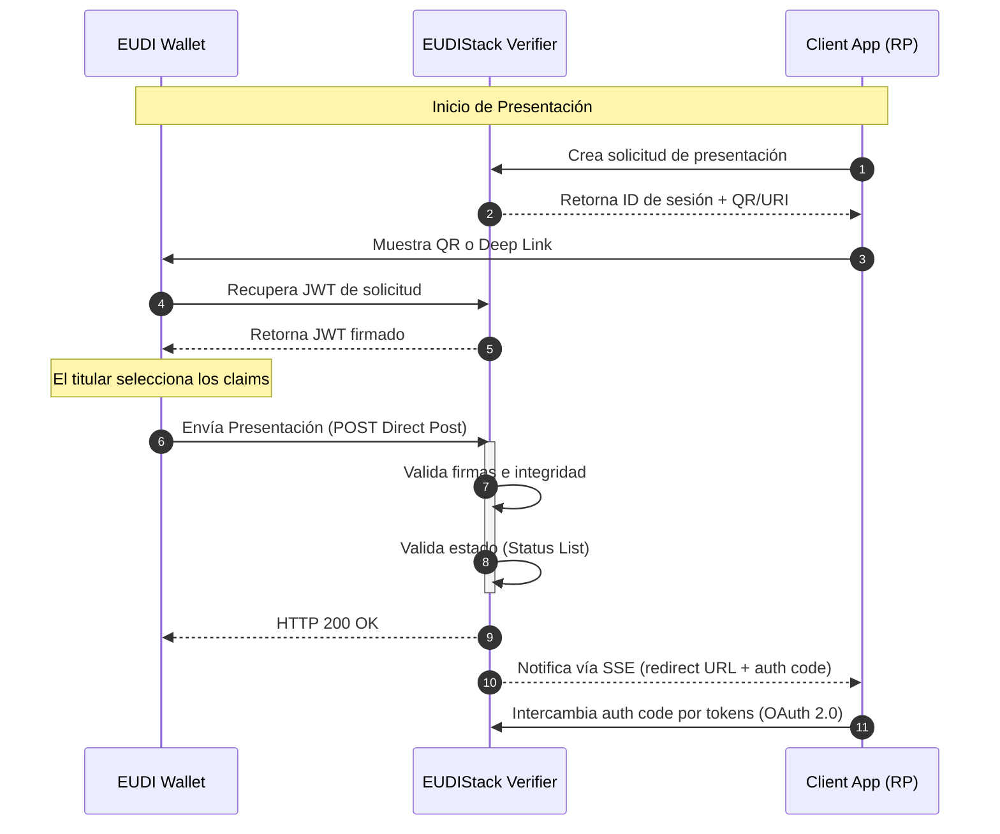

# OID4VP — OpenID for Verifiable Presentations

OID4VP es el protocolo estándar que define cómo un Verificador solicita y recibe presentaciones de credenciales verificables desde un wallet. La implementación de EUDIStack actúa como el componente verificador, permitiendo a aplicaciones de terceros consumir datos de identidad de forma segura y estandarizada.

Los formatos de credencial soportados para la verificación incluyen **SD-JWT VC** (identificador normativo: `dc+sd-jwt`) y **JWT VC** (identificador: `jwt_vc_json`).

---

## Flujos de presentación

La implementación soporta flujos adaptados a diferentes contextos de interacción entre el titular y la entidad verificadora:

=== "Cross-device (QR)"
    El titular interactúa con una aplicación web en un dispositivo y utiliza el wallet en otro para escanear un código QR e iniciar la presentación.

    **Pasos del flujo:**

    1. La aplicación cliente solicita al Verifier la creación de una sesión de presentación.
    2. El Verifier retorna un `session_id` y la URL de la solicitud de autorización (codificada como QR o deep link).
    3. La aplicación muestra el QR al usuario en la pantalla del dispositivo web.
    4. El usuario escanea el QR con su wallet EUDI en un segundo dispositivo.
    5. El wallet descarga el JWT de la solicitud (`POST /oid4vp/auth-request/{id}`) y presenta los claims seleccionados (`POST /oid4vp/auth-response`).
    6. El Verifier valida la presentación y notifica a la aplicación vía SSE con el resultado.

=== "Direct Post"
    Mecanismo mediante el cual el wallet envía la presentación directamente al endpoint del verificador a través de una petición HTTP POST, garantizando la privacidad y seguridad del intercambio.

    **Funcionamiento:**

    - El parámetro `response_mode=direct_post` en el JWT de la solicitud indica al wallet que debe enviar el `vp_token` directamente al `response_uri` del Verifier, en lugar de incluirlo en la URL de redirección.
    - El wallet construye el VP Token (cadena SD-JWT con los disclosures seleccionados y el Key Binding JWT) y lo envía mediante `POST` al endpoint `response_uri`.
    - El Verifier verifica las firmas, la vinculación de clave y el estado de revocación antes de emitir la notificación a la aplicación cliente.
    - Este modo es el utilizado por defecto en EUDIStack tanto en flujos cross-device como same-device.

---

## Diagrama del flujo

El proceso de presentación se basa en una interacción coordinada entre la aplicación cliente, el componente verificador de EUDIStack y el wallet del usuario.
La secuencia comienza con la creación de una sesión de verificación y termina con la entrega de los claims validados a la aplicación solicitante tras una comprobación íntegra de firmas y estados de revocación.


---

## Anatomía de una Solicitud

??? note "Ejemplo de objeto de solicitud de presentación"
    El objeto central de OID4VP es la solicitud de presentación. A continuación se muestra un ejemplo de un objeto JSON que el wallet resuelve al iniciar el flujo para una credencial de empleado:

    > **Nota sobre identificadores:** El campo `vct_values` dentro de la consulta DCQL contiene el tipo de credencial verificable (VC Type), definido en el campo `vct` de la credencial emitida (p. ej., `eu.europa.ec.eudi.lce.1`). Este valor es distinto del `credential_configuration_id` presente en la oferta de emisión (OID4VCI), que es el identificador de la configuración en los metadatos del Issuer.

    ```json
    {
      "iss": "did:key:z6Mk...",
      "aud": "https://self-issued.me/v2",
      "iat": 1746524400,
      "exp": 1746524700,
      "jti": "550e8400-e29b-41d4-a716-446655440000",
      "client_id": "did:key:z6Mk...",
      "nonce": "a4f8c2d1-3e7b-4a9d-b5f0-1c6e2a8d4f7b",
      "response_uri": "https://verifier.example.com/oid4vp/auth-response",
      "scope": "openid learcredential.employee",
      "state": "9f3b1c2a-7e4d-48a5-b0f2-3d6c8e1a5b9f",
      "response_type": "vp_token",
      "response_mode": "direct_post",
      "dcql_query": {
        "credentials": [
          {
            "id": "lear_employee_sd_jwt",
            "format": "dc+sd-jwt",
            "meta": {
              "vct_values": ["eu.europa.ec.eudi.lce.1"]
            }
          }
        ]
      },
      "client_metadata": {
        "vp_formats_supported": {
          "dc+sd-jwt": {
            "sd-jwt_alg_values": ["ES256"],
            "kb-jwt_alg_values": ["ES256"]
          },
          "jwt_vc_json": {
            "alg_values_supported": ["ES256"]
          }
        }
      }
    }
    ```

---

## Referencias

* **Especificación Oficial:** [OID4VP 1.0](https://openid.net/specs/openid-4-verifiable-presentations-1_0.html)
* **Consulta de Credenciales:** [Digital Credential Query Language (DCQL)](https://openid.net/specs/openid-4-verifiable-presentations-1_0.html#name-digital-credentials-query-l)
* **Referencia API:** [Endpoints del Verificador](../api-reference/verifier.md)