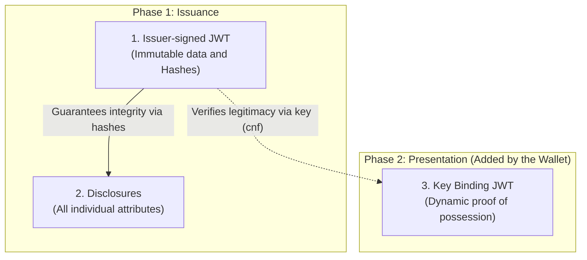

# SD-JWT VC — Selective Disclosure JWT

SD-JWT VC (*Selective Disclosure JSON Web Token Verifiable Credential*) is one of the verifiable credential formats supported by the EUDIStack implementation. Based on [RFC 9901](https://datatracker.ietf.org/doc/rfc9901/), this format allows for the selective disclosure of attributes, ensuring that the holder only shares the necessary data in each verification process.

The implementation uses the format identifier dc+sd-jwt and supports signatures using JAdES to ensure integrity and non-repudiation.

---

## Format Particularities

The SD-JWT VC format introduces a privacy architecture that differentiates it from traditional JWT credentials:

=== "Privacy by design"
    The system generates the credential in such a way that individual attributes are processed independently (disclosures). This allows the wallet to decide which fields to reveal to the verifier without invalidating the issuer's signature.

=== "Key binding"
    To prevent unauthorized use or interception, the credential can be cryptographically bound to the holder's public key (`cnf`). The verifier requires a proof of possession (Key Binding JWT) to confirm the legitimacy of the presenter.

=== "Signature efficiency"
    Unlike other formats, the credential is signed only once by the issuer and can be presented multiple times with different combinations of revealed attributes.

---

## Structure Diagram

To understand the architecture of an SD-JWT, it is essential to divide its components according to the phase of its life cycle and the actor that generates them:



=== "Phase 1: Issuance (Issuer)"
    The issuer generates the **Issuer-signed JWT** (which contains the static data and security hashes) and the **Disclosures** (the individually packaged attributes). Both are delivered to the holder's wallet.

=== "Phase 2: Presentation (Wallet)"
    When the holder wishes to share the credential, the wallet selects the relevant Disclosures and dynamically generates the **Key Binding JWT**. This last element is a temporary signature generated by the wallet to prove to the verifier that it possesses the cryptographic key associated with the credential.

---

## Anatomy of a credential

??? note "Internal components of the SD-JWT VC"

    === "Issuer-signed JWT Payload"
        The following example illustrates the state of the payload before signing. Sensitive attributes are not included in clear text; instead, their hashes are inserted inside the `_sd` array.

        ```json
        {
          "iss": "[https://issuer.eudistack.eu](https://issuer.eudistack.eu)",
          "iat": 1746057600,
          "nbf": 1746057600,
          "exp": 1777593600,
          "vct": "[https://credentials.eudistack.eu/.well-known/credentials/lear_credential_employee/sd-jwt/v1](https://credentials.eudistack.eu/.well-known/credentials/lear_credential_employee/sd-jwt/v1)",
          "mandate": {
            "_sd_alg": "sha-256",
            "_sd": [
              "X9a3vQr2mNkLpTjHoDcE7f1uWsYiBgAzV4OIeRlFnCw",
              "tK8mPqVzLsNjDcHoBaE5g..."
            ]
          },
          "status": {
            "status_list": {
              "idx": 42,
              "uri": "[https://issuer.eudistack.eu/api/v1/credential-status/list/1](https://issuer.eudistack.eu/api/v1/credential-status/list/1)"
            }
          },
          "cnf": {
            "jwk": {
              "kty": "EC",
              "crv": "P-256",
              "x": "f83OJ3D2xF1Bg8vub9tLe1gHMzV76e8Tus9uPHvRVEU",
              "y": "x_FEzRu9m36HLN_tue659LNpXW6pCyStikYjKIWI5a0"
            }
          }
        }
        ```

    === "Serialization string"
        For transmission, the credential is formatted as a text string where each component is separated by the tilde character (`~`).

        ```text
        [signed_jwt]~[disclosure_1]~[disclosure_2]~[key_binding_jwt]
        ```

        > **Note:** In the standard issuance process (when the holder receives the credential for the first time and the Key Binding is not included), the string always concludes with an empty final tilde: `[signed_jwt]~[disclosure_1]~[disclosure_2]~`.

---

## References

- **Official Specification**: [SD-JWT VC (RFC 9901)](https://datatracker.ietf.org/doc/rfc9901/)
- **HAIP Profile**: [Standards](../../reference/standards.md)