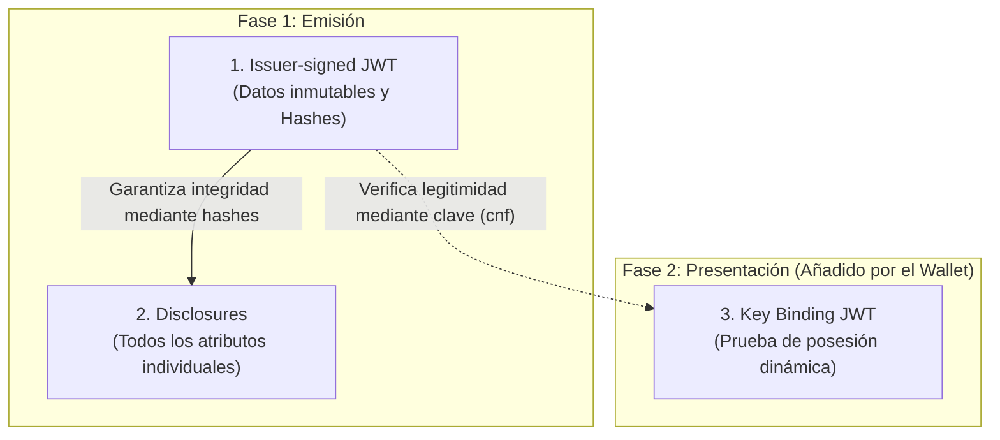

# SD-JWT VC — Selective Disclosure JWT

SD-JWT VC (*Selective Disclosure JSON Web Token Verifiable Credential*) es uno de los formatos de credencial verificable soportados por la implementación de EUDIStack. Basado en el [RFC 9901](https://datatracker.ietf.org/doc/rfc9901/), este formato permite la revelación selectiva de atributos, garantizando que el titular comparta únicamente los datos necesarios en cada proceso de verificación.

La implementación utiliza media type `dc+sd-jwt` y soporta firmas mediante JAdES para asegurar la integridad y el no repudio.

---

## Particularidades del formato

El formato SD-JWT VC introduce una arquitectura de privacidad que lo diferencia de las credenciales JWT tradicionales:

1. **Privacidad por diseño**: El sistema genera la credencial de modo que los atributos individuales se procesan de forma independiente (disclosures). Esto permite que el wallet decida qué campos revelar al verificador sin invalidar la firma del emisor.
2. **Vinculación de clave**: Para prevenir el uso no autorizado o la interceptación, la credencial puede vincularse criptográficamente a la clave pública del titular (`cnf`). El verificador exige una prueba de posesión (Key Binding JWT) para confirmar la legitimidad del presentador.
3. **Eficiencia en la firma**: A diferencia de otros formatos, la credencial se firma una sola vez por el emisor y puede presentarse múltiples veces con diferentes combinaciones de atributos revelados.

---

## Diagrama de estructura

Para comprender la arquitectura de un SD-JWT, es fundamental dividir sus componentes según la fase de su ciclo de vida y el actor que los genera:

1. **Fase de Emisión (Issuer):** El emisor genera el **Issuer-signed JWT** (que contiene los datos estáticos y los hashes de seguridad) y los **Disclosures** (los atributos empaquetados individualmente). Ambos se entregan al wallet del titular.
2. **Fase de Presentación (Wallet):** Cuando el titular desea compartir la credencial, el wallet selecciona los Disclosures pertinentes y genera dinámicamente el **Key Binding JWT**. Este último elemento es una firma temporal generada por el wallet para demostrar al verificador que posee la clave criptográfica asociada a la credencial.

El siguiente diagrama ilustra esta separación de responsabilidades:



---

## Anatomía de una credencial

### Payload del Issuer-signed JWT
El siguiente ejemplo ilustra el estado del payload antes de la firma. Los atributos sensibles no se incluyen en texto claro; en su lugar, se insertan sus hashes dentro del array `_sd`.
```json
{
  "iss": "https://issuer.eudistack.eu",
  "iat": 1746057600,
  "nbf": 1746057600,
  "exp": 1777593600,
  "vct": "https://credentials.eudistack.eu/.well-known/credentials/lear_credential_employee/sd-jwt/v1",
  "mandate": {
    "_sd_alg": "sha-256",
    "_sd": [
      "X9a3vQr2mNkLpTjHoDcE7f1uWsYiBgAzV4OIeRlFnCw",
      "tK8mPqVzLsNjDcHoBaE5g..."
    ]
  },
  "status": {
    "status_list": {
      "idx": 42,
      "uri": "https://issuer.eudistack.eu/api/v1/credential-status/list/1"
    }
  },
  "cnf": {
    "jwk": {
      "kty": "EC",
      "crv": "P-256",
      "x": "f83OJ3D2xF1Bg8vub9tLe1gHMzV76e8Tus9uPHvRVEU",
      "y": "x_FEzRu9m36HLN_tue659LNpXW6pCyStikYjKIWI5a0"
    }
  }
}
```

### Cadena de serialización
Para su transmisión, la credencial se formatea como una cadena de texto donde cada componente se separa mediante el carácter tilde (`~`).

```text
[jwt_firmado]~[disclosure_1]~[disclosure_2]~[key_binding_jwt]
```

> **Nota:** En el proceso estándar de emisión (cuando el titular recibe la credencial por primera vez y no se incluye el Key Binding), la cadena siempre concluye con una tilde final vacía: `[jwt_firmado]~[disclosure_1]~[disclosure_2]~`.

---

## Referencias

- **Especificación Oficial**: [SD-JWT VC (RFC 9901)](https://datatracker.ietf.org/doc/rfc9901/)
- **Perfil HAIP**: [Estándares](../../reference/standards.md)
