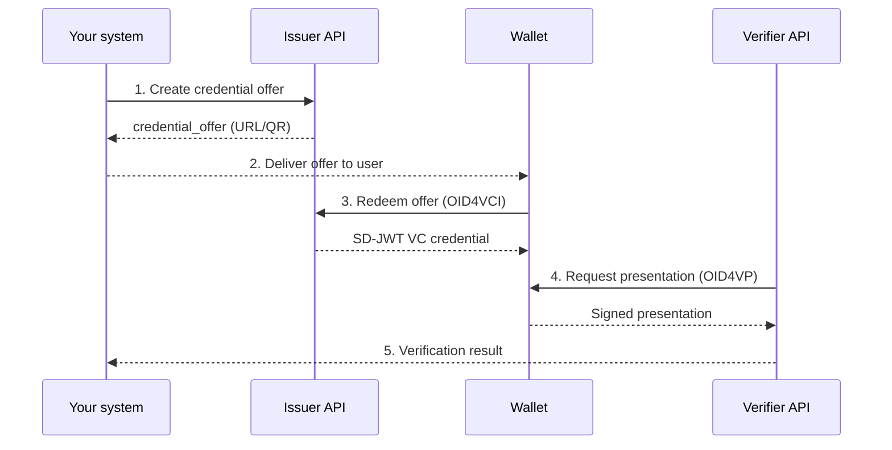

# Your First Integration

This guide walks you step by step through a complete flow: issuing a credential, receiving it in a test wallet, and presenting it to a Verifier.

## Flow diagram



??? info "Prerequisites before starting"

    - Access to the sandbox. Request it at [Sandbox](sandbox.md). Environment URLs:
        - Issuer: `https://sandbox-stg.eudistack.net/issuer`
        - Wallet: `https://sandbox-stg.eudistack.net/wallet`
        - Verifier: `https://sandbox-stg.eudistack.net/verifier`
    - A valid Bearer Token (provided by the EUDIStack team when granting sandbox access).
    - Postman or curl.

## Step 1: Create a credential (Issuer)

=== "Request"

    ```http
    POST https://sandbox-stg.eudistack.net/issuer/api/v1/issuances
    Content-Type: application/json
    Authorization: Bearer {{token}}
    ```

=== "Body"

    ```json
    {
      "credential_configuration_id": "learcredential.employee.sd.1",
      "payload": {
        "mandator": {
          "organizationIdentifier": "VATES-12345678A",
          "organization": "EUDIStack Demo",
          "commonName": "Admin User",
          "email": "admin@eudistack.com",
          "country": "ES"
        },
        "mandatee": {
          "firstName": "Mandatee",
          "lastName": "Test",
          "email": "mandatee-test@eudistack.com"
        },
        "power": [
          {
            "function": "Admin",
            "action": ["Execute"]
          }
        ]
      },
      "delivery": "ui",
      "email": "your-email@x.com",
      "grant_type": "urn:ietf:params:oauth:grant-type:pre-authorized_code"
    }
    ```

=== "Response"

    ```json
    {
      "credential_offer_uri": "openid-credential-offer://?credential_offer_uri=https://sandbox-stg.eudistack.net/issuer/oid4vci/v1/credential-offer/XXXX"
    }
    ```

## Step 2: Open the Credential Offer (Wallet)

1. Copy the `credential_offer_uri` from the previous response.
2. Go to the wallet: `https://sandbox-stg.eudistack.net/wallet`.
3. Log in or create a wallet.
4. Select "Scan credential".
5. Paste the previously copied `credential_offer_uri`.

The Wallet will automatically interpret the offer.

## Step 3: Credential redemption (OID4VCI)

If the flow is **pre-authorized code**:

- The Wallet requests an **activation code** (`tx_code`).
- Enter the code received by email.

Once validated:

- The Wallet exchanges the `pre-authorized_code` for an `access_token`.
- Downloads the signed credential from the Issuer.
- Stores the credential in the user's Wallet.

## Step 4: Start verification (OID4VP)

=== "Request"

    ```http
    POST https://sandbox-stg.eudistack.net/verifier/api/v1/authorization-request
    ```

=== "Response"

    ```json
    {
      "session_id": "abc123",
      "request_uri": "openid-vp://verifier/request/abc123",
      "expires_in": 120
    }
    ```

    > **Note:** the `session_id` value is the `{id}` used in **Option B: Polling** (`GET /verifier/oid4vp/auth-request/{id}`).

Open the Wallet:

1. Scan or copy the Verifier request.
2. Select the credential to present.

## Step 5: Retrieve verification result

There are two ways to obtain the result.

=== "Option A: Callback"

    The Verifier sends the result to your `redirect_uri` once the Wallet completes the presentation:

    ```http
    POST /oid4vp/auth-response
    Content-Type: application/x-www-form-urlencoded
    ```

    The Verifier responds with a redirect:

    ```json
    {
      "redirect_uri": "https://your-app.com/callback?code=abc&state=xyz"
    }
    ```

=== "Option B: Polling"

    Query the verification status by session ID:

    ```http
    GET https://sandbox-stg.eudistack.net/verifier/oid4vp/auth-request/{id}
    ```

    ```json
    {
      "verified": true,
      "credential_type": "learcredential.employee.sd.1"
    }
    ```

## Next steps

- [Concepts: OID4VCI](../concepts/oid4vci.md)
- [Concepts: OID4VP](../concepts/oid4vp.md)
- [API Reference](../api-reference/index.md)