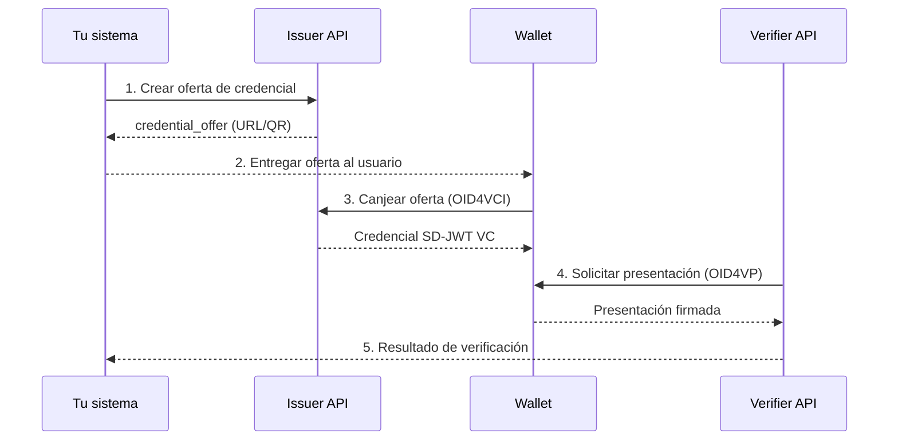

# Tu primera integración

<!-- TODO: completar con ejemplos curl reales contra sandbox -->

Esta guía te lleva paso a paso por un flujo completo: emitir una credencial, recibirla en un wallet de prueba y presentarla a un Verifier.

## Esquema del flujo



## Prerrequisitos
Antes de empezar necesitas:
- Acceso al sandbox:
  - Issuer: `https://sandbox-stg.eudistack.net/issuer`
  - Wallet: `https://sandbox-stg.eudistack.net/wallet`
  - Verifier: `https://sandbox-stg.eudistack.net/verifier`
- Un Bearer Token válido (proporcionado por sandbox).
- Postman o curl.

## Paso 1: Crear una credencial (Issuer)
### Request
```http
POST https://sandbox-stg.eudistack.net/issuer/api/v1/issuances
```
### Headers
```http
Content-Type: application/json
Authorization: Bearer {{token}}
```

### Body
```json
{
  "credential_configuration_id": "learcredential.employee.sd.1",
  "payload": {
    "mandator": {
      "organizationIdentifier": "VATES-12345678A",
      "organization": "EUDIStack Demo",
      "commonName": "Admin User",
      "email": "admin@eudistack.com",
      "country": "ES"
    },
    "mandatee": {
      "firstName": "Mandatee",
      "lastName": "Test",
      "email": "mandatee-test@eudistack.com"
    },
    "power": [
      {
        "function": "Admin",
        "action": ["Execute"]
      }
    ]
  },
  "delivery": "ui",
  "email": "tu-correo@x.com",
  "grant_type": "urn:ietf:params:oauth:grant-type:pre-authorized_code"
}
```

### Response
```json
{
  "credential_offer_uri": "openid-credential-offer://?credential_offer_uri=https://sandbox-stg.eudistack.net/issuer/oid4vci/v1/credential-offer/XXXX"
}
```

## Paso 2: Abrir la Credential Offer (Wallet)
1. Copia el `credential_offer_uri` de la respuesta anterior.
2. Accede al wallet `https://sandbox-stg.eudistack.net/wallet`.
3. Inicia sessión o crea un wallet.
4. Selecciona "Scan credential".
4. Pega el `credential_offer_uri` copiado anteriormente.

El Wallet interpretará automáticamente la oferta.


## Paso 3: Canje de credencial (OID4VCI)

Si el flujo es **pre-authorized code**:
- El Wallet solicita un **código de activación** `tx_code`.
- Introduce el código recibido por email.

Una vez validado:
- El Wallet intercambia el `pre-authorized_code` por un `access_token` 
- Descarga la credencial firmada desde el Issuer.
- Almacena la credencial en el Wallet del usuario.


## Paso 4: Iniciar verificación (OID4VP)
### Request
```http
POST https://sandbox-stg.eudistack.net/verifier/api/v1/authorization-request
```
### Response
```json
{
  "request_uri": "openid://verifier/request/abc123",
  "expires_in": 120
}
```
Abre el Wallet:
1. Escanea o copia la solicitud del Verifier.
2. Selecciona la credencial a presentar.

## Paso 5: Recoger resultado de la verificación
Existen dos formas de obtener el resultado.

### Opción A: Callback
```http
POST /oid4vp/auth-response
Content-Type: application/x-www-form-urlencoded
```
El Verifier responde con redirección:
```json
{
  "redirect_uri": "https://tu-app.com/callback?code=abc&state=xyz"
}
```

### Opción B:
Puedes consultar el estado de la verificación:
```http
GET https://sandbox-stg.eudistack.net/verifier/oid4vp/auth-request/{id}
```

#### Response
```json
{
  "verified": true,
  "credential_type": "learcredential.employee.sd.1"
}
```

## Próximos pasos

- [Conceptos: OID4VCI](../concepts/oid4vci.md)
- [Conceptos: OID4VP](../concepts/oid4vp.md)
- [Referencia API](../api-reference/index.md)
