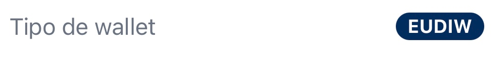
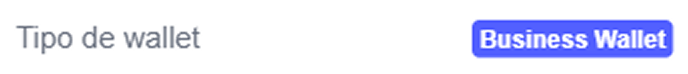

# User Guides

Welcome. This section explains how to use EUDIStack applications in your day-to-day work.

---

## Wallet type

??? info "How do I know which type of wallet I am using?"
    Open **[Settings](wallet-eudiw/settings.md)**. The **[Wallet type](wallet-eudiw/settings.md#walletType)** field shows the active mode.

    `EUDIW`:

    { width="320" }

    `Business Wallet`:

    { width="320" }

---

## Available tools

-   :material-wallet: **Wallet — EUDIW**

    ---

    The **personal** wallet. Keys and credentials are stored on your own device. Designed for citizens and professionals who manage their identity autonomously.

    [:octicons-arrow-right-24: Get started](wallet-eudiw/index.en.md)

-   :material-briefcase: **Wallet — Business Wallet**

    ---

    The **organisational** wallet (EBW). Keys are held on the server with enhanced authentication. Designed for employees of organisations.

    [:octicons-arrow-right-24: Get started](wallet-business/index.en.md)

---

## Something not working?

Before contacting support, check the [troubleshooting](troubleshooting.md) section: it covers the most frequent errors and questions.
