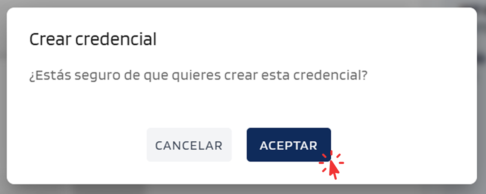
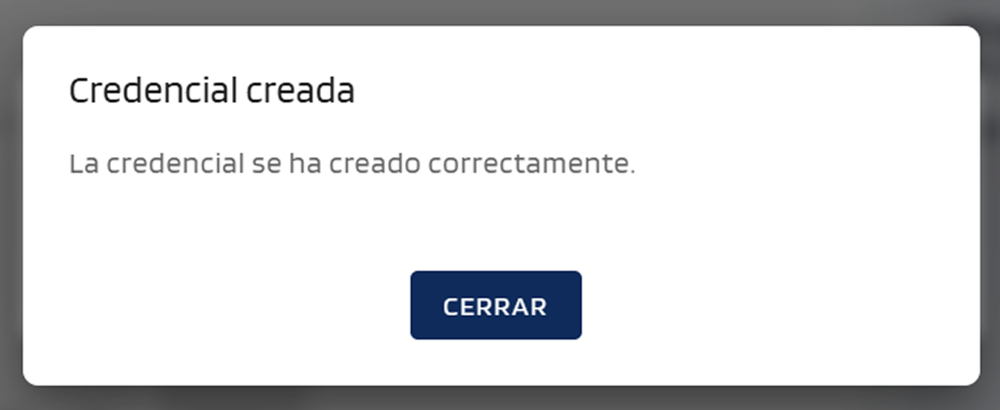

# Emitir una credencial

Pasos para emitir una credencial desde el portal.

## Pasos

1. **Iniciar sesión** en el Portal Issuer con la credencial organizativa.

    El portal mostrará un código QR en pantalla o facilita un enlace para pegarlo directamente en el wallet.

    { width="640" }

    Abrir el wallet, escanear el QR o copiar y pegar el contenido manualmente.

    { width="240" }

    !!! note "Más información sobre presentar credenciales desde el wallet"
        - [Presentar credenciales](../wallet-eudiw/present-credentials.md)

    Seleccionar la credencial organizativa y confirmar.

    { width="320" }

    El portal dará acceso automáticamente.

2. **Pulsar *Nueva credencial***: tras el acceso, el portal muestra la tabla de credenciales emitidas. Pulsar el botón **Nueva credencial** para iniciar el proceso de emisión.

    { width="640" }

3. **Seleccionar el tipo de credencial** a emitir (depende del catálogo configurado para la organización).

    { width="240" }

4. **Rellenar los atributos y seleccionar el método de entrega**: el portal muestra el formulario de emisión. Rellenar los atributos del destinatario (nombre, email y los campos específicos del tipo). En la esquina superior derecha se muestra el selector de **método de entrega**; seleccionar *por email* o *en pantalla* (QR para escaneo inmediato).

    { width="640" }

5. **Confirmar**: pulsar el botón **Crear credencial** para enviar el formulario.

    { width="320" }

    El portal muestra un diálogo de confirmación. Pulsar **Aceptar** para completar la emisión.

    { width="400" }

    El resultado varía según el método de entrega seleccionado:

    - **Corre electrónico**: el portal muestra una notificación de éxito y en breve el destinatario recibe el correo con la oferta de credencial.

        { width="400" }

    - **Código QR**: el portal muestra un diálogo con el código QR y un botón *Copiar enlace*. El destinatario escanea el QR con el wallet o pega el enlace copiado manualmente.

        { width="400" }

6. **El destinatario acepta la oferta** desde su wallet — momento en el que la credencial queda emitida.

##  Consultar el estado de las emisiones

Para consultar los posibles estados de una credencial, ver [Gestionar emisiones → Estados de las emisiones](manage-issuances.md#estados-de-las-emisiones).