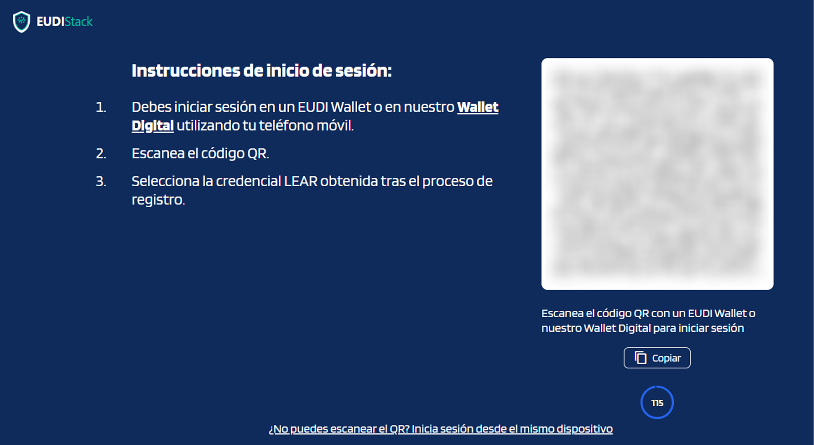
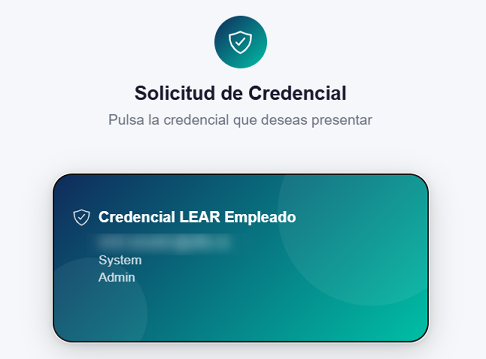
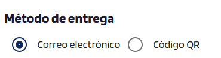

# Emitir una credencial

<!-- TODO: contenido pendiente -->

Pasos para emitir una credencial desde el portal.

## Flujo general

1. **Inicia sesión** en el Portal Issuer con tu credencial organizativa.

    El portal mostrará un código QR en pantalla.

    { width="560" }

    Abre tu wallet, escanea el QR o copia y pega el contenido manualmente.

    { width="240" }

    Selecciona tu credencial organizativa y confirma.

    { width="320" }

    El portal te dará acceso automáticamente.

2. **Selecciona el tipo de credencial** que quieres emitir (depende del catálogo configurado para tu organización).

    { width="240" }

3. **Rellena los atributos** del destinatario (nombre, email, atributos específicos del tipo). Elige también el método de entrega: *por email* o *mediante QR* para escaneo presencial.

    { width="240" }

4. **Confirma**: el portal genera una oferta y la entrega según el método seleccionado.

5. **El destinatario acepta la oferta** desde su wallet — momento en el que la credencial queda emitida.

## Estados durante el flujo

- **BORRADOR**: oferta enviada, todavía no aceptada por el destinatario.
- **VÁLIDO**: el destinatario ha aceptado la credencial y está en su wallet en periodo de validez.
- **EXPIRADO**: la credencial ha superado su fecha de validez.
- **RETIRADO**: el emisor ha cancelado la oferta antes de que el destinatario la aceptara.
- **REVOCADO**: el emisor ha revocado la credencial explícitamente; deja de ser válida aunque no haya alcanzado su
  fecha de caducidad.

<!-- TODO: capturas del wizard de emisión -->
