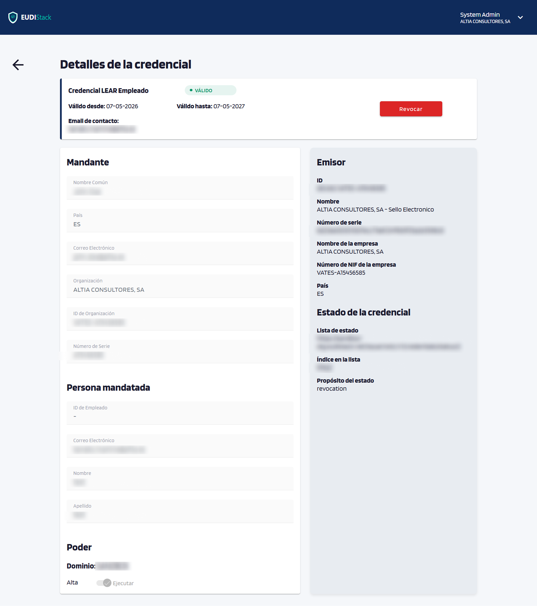
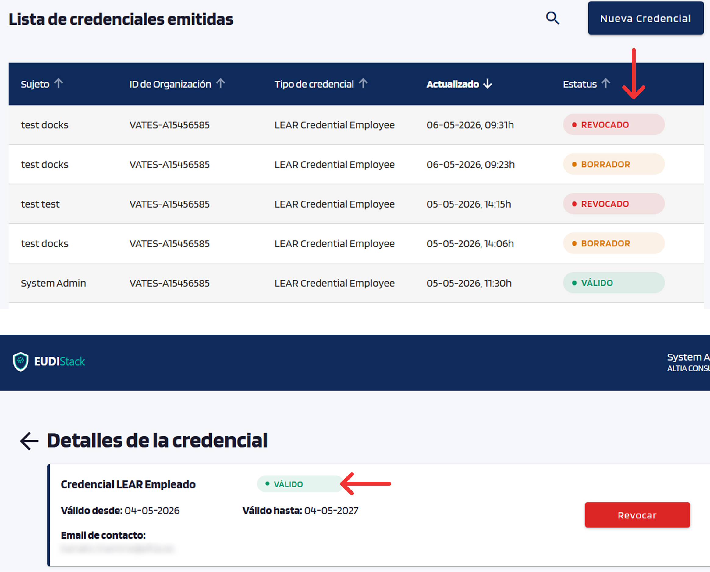

# Gestionar emisiones

Consultar y operar sobre credenciales ya emitidas.

## Listado de emisiones

La pantalla de gestión lista todas las emisiones lanzadas con:

- Sujeto (destinatario).
- Tipo de credencial.
- Última actualización.
- Estado (BORRADOR / VÁLIDO / EXPIRADO / RETIRADO / REVOCADO).

{ width="640" }

Pulsar una fila de la tabla para acceder al detalle de esa emisión.

## Detalle de una emisión

Muestra toda la información de la credencial seleccionada: atributos, estado actual, fechas de emisión y caducidad, e historial de cambios de estado.

{ width="640" }

!!! note "Secciones Emisor y Estado de la credencial"
    Las secciones **Emisor** y **Estado de la credencial** aparecen únicamente cuando el destinatario ha aceptado la credencial desde su wallet.

## Estados durante el flujo de emisión

El estado de cada emisión es visible tanto en la tabla del listado como en la pantalla de detalle de la credencial. Cada estado determina qué acciones están disponibles; consultar el apartado [Acciones](#acciones) para más información.

- **BORRADOR**: oferta enviada, todavía no aceptada por el destinatario.
- **VÁLIDO**: el destinatario ha aceptado la credencial y está en su wallet en periodo de validez.
- **EXPIRADO**: la credencial ha superado su fecha de validez.
- **RETIRADO**: el emisor ha cancelado la oferta antes de que el destinatario la aceptara.
- **REVOCADO**: el emisor ha revocado la credencial explícitamente; deja de ser válida aunque no haya alcanzado su fecha de caducidad.

{ width="400" }

## Acciones

Las acciones se realizan desde la pantalla de detalle de la credencial. Solo algunas acciones están disponibles según el estado de la emisión.

- **Retirar**: aparece en estado *BORRADOR*; cancela la oferta antes de que el destinatario la acepte. Si la oferta no llegó o algún dato es incorrecto, retirar la emisión actual y emitir una nueva credencial con los datos correctos.

    { width="560" }

- **Revocar**: aparece en estado *VÁLIDO*; marca la credencial como revocada en el Status List público (cualquier verifier podrá comprobarlo).

    { width="560" }