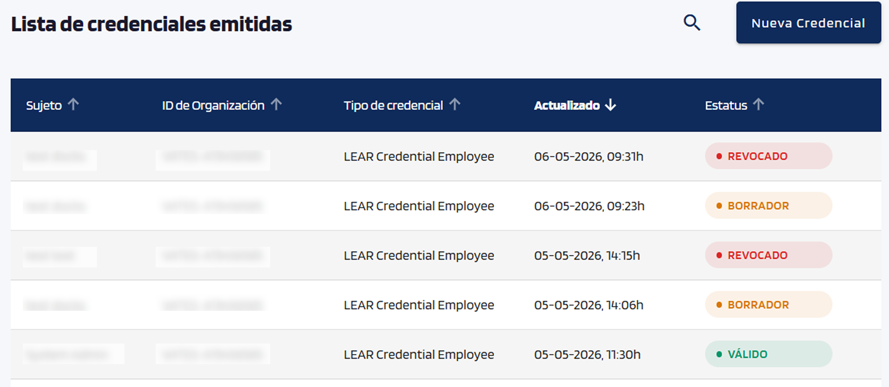
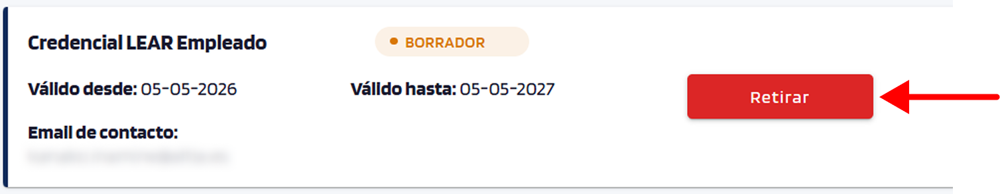
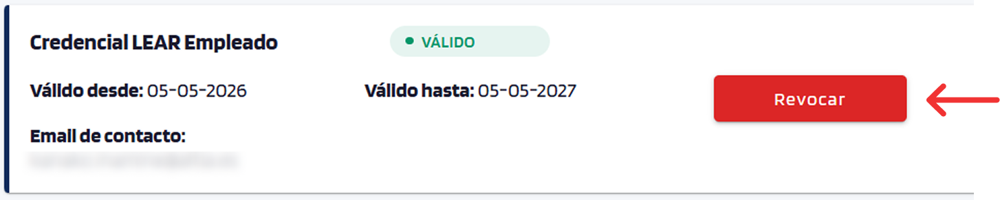

# Gestionar emisiones

Consultar y operar sobre credenciales ya emitidas.

## Listado de emisiones

La pantalla de gestión de credenciales lista todas las emisiones lanzadas con:

- Sujeto (destinatario).
- Tipo de credencial.
- Última actualización.
- Estado (BORRADOR / VÁLIDO / EXPIRADO / RETIRADO / REVOCADO).

    { width="560" }

## Acciones

- **Retirar**: aparece en estado *BORRADOR*; cancela la oferta antes de que el destinatario la acepte. Si la oferta no llegó o el email es incorrecto, retirar la emisión actual y emitir una nueva credencial con los datos correctos.

    { width="560" }

- **Revocar**: aparece en estado *VÁLIDO*; marca la credencial como revocada en el Status List público (cualquier verifier podrá comprobarlo).

    { width="560" }