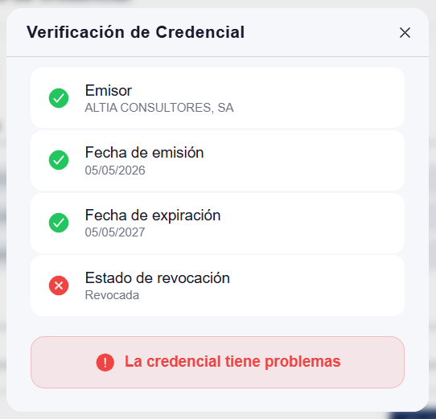

# Solución de problemas — Usuarios

Esta sección recoge los problemas más frecuentes y cómo resolverlos. Si el problema no aparece, consulta [soporte](../support.md).

---

## Wallet

??? "El QR de la oferta no se abre"
    - **Síntoma**: al escanear el QR no ocurre ninguna acción, o aparece un error.
    - **Causa probable**: el QR ha caducado, la oferta ya se consumió o el wallet no es del tenant correcto.
    - **Solución**: solicitar una nueva oferta al emisor; verificar que el wallet pertenece al mismo tenant que el emisor (mismo dominio).

    !!! info "Páginas relacionadas"
        - [Emitir una credencial](../admin/issuer-portal/issue-credential.md) — cómo el emisor genera una nueva oferta
        - [Recibir credenciales](wallet-eudiw/receive-credentials.md) — cómo aceptar la nueva oferta desde el wallet

??? "Error al crear el passkey"
    - **Síntoma**: al activar el wallet, la creación del passkey falla.
    - **Causa probable**: el navegador o sistema operativo no soporta WebAuthn con extensión PRF.
    - **Solución**: actualiza el navegador y SO a las últimas versiones. En iOS exige iOS 17+; en Android, Chrome 122+.

??? "La credencial aparece como revocada"
    - **Síntoma**: al presentarla a un Verifier, este informa de que la credencial está revocada.
    - **Causa probable**: el emisor revocó la credencial (cambio de rol, baja en la organización).
    - **Solución**: antes de contactar con el emisor, comprobar el estado actual de la credencial: abrir el detalle de la credencial en el wallet y pulsar **Verificar credencial**.

    { width="240" }

    Si la credencial aparece como revocada, contactar con el emisor; es necesario solicitar una nueva credencial.

    !!! info "Páginas relacionadas"
        - [Gestionar credenciales](wallet-eudiw/manage-credentials.md) — cómo verificar y gestionar el estado de las credenciales en el wallet

??? "La presentación no llega al verifier"
    - **Síntoma**: el usuario confirma en su wallet pero el verifier no recibe nada.
    - **Causa probable**: timeout de la sesión o problemas de red.
    - **Solución**: reiniciar la solicitud. Si persiste, [contactar con soporte](../support.md) proporcionando la URL del verifier y el código de QR si es posible.

---

## ¿Sigues sin resolverlo?

[Contacta con soporte](../support.md). Incluye:

- Wallet/aplicación afectada.
- Captura del error si la hay.
- Hora aproximada del incidente.
- La organización (tenant).
