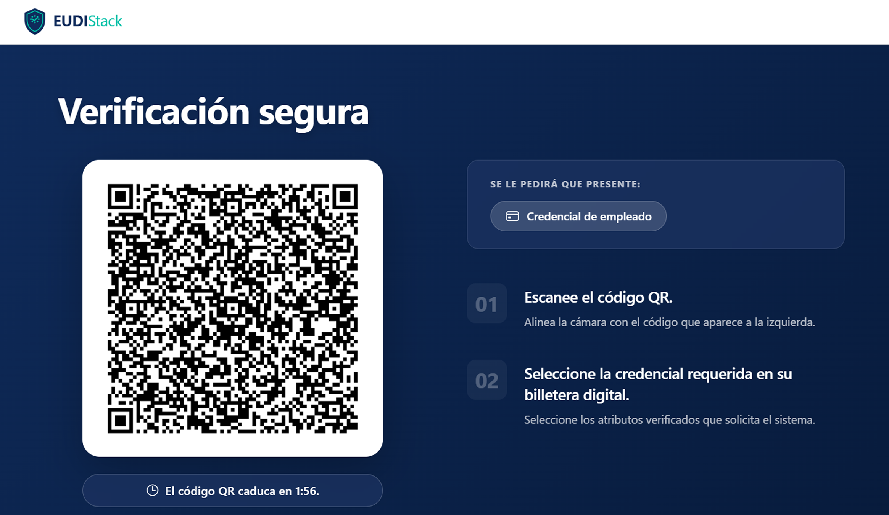
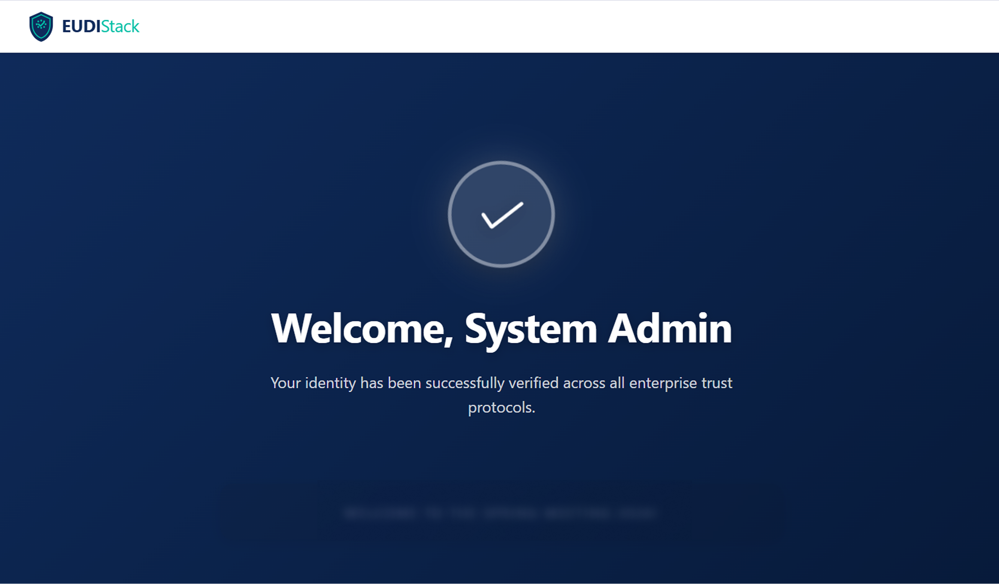

# Verificación presencial

Verificación cara a cara, típicamente en controles de acceso físico o atención presencial.

## Pasos

1. **El verifier presenta el QR** desde la app *Proximity Verifier*.

    { width="560" }

2. **El usuario abre su wallet** y escanea el QR. El wallet muestra automáticamente la credencial solicitada.

    { width="240" }

3. **El usuario selecciona la credencial** y confirma el envío con su passkey.

    { width="240" }

4. **El verifier muestra el resultado** en pantalla con los datos de la credencial verificada.

    { width="560" }

## Casos típicos

- Control de acceso a edificios.
- Eventos profesionales con acreditación digital.
- Atención al cliente con verificación de identidad presencial.

