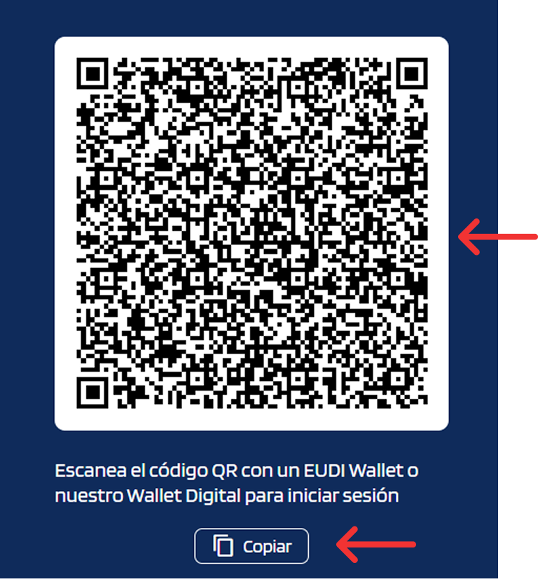

# Verificación remota

Verificación online de credenciales: el verifier solicita una credencial al usuario, quien la presenta desde su wallet de forma remota — por ejemplo, desde casa o desde cualquier dispositivo con conexión —, sin necesidad de coincidir físicamente con el verifier.
## Pasos

1. **El verifier muestra un código QR** para que el usuario lo escanee con su wallet, o facilita el enlace para pegarlo directamente en el wallet.

    { width="240" }

2. **El usuario escanea el QR** o pega el enlace en su wallet. El wallet muestra automáticamente la credencial solicitada.

    { width="240" }

    !!! note "Cómo presentar credenciales desde el wallet"
        - [Presentar credenciales](../wallet-eudiw/present-credentials.md)

3. **El usuario selecciona la credencial** y confirma el envío con su passkey.

    { width="240" }

4. **El verifier recibe y comprueba la credencial** automáticamente y muestra el resultado.

## Casos típicos

- Registro de clientes online (KYC).
- Acceso a portales que exigen credencial corporativa.
- Validación de cualificación profesional online.