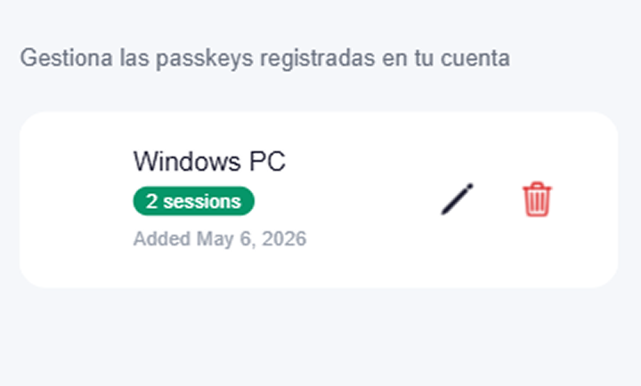
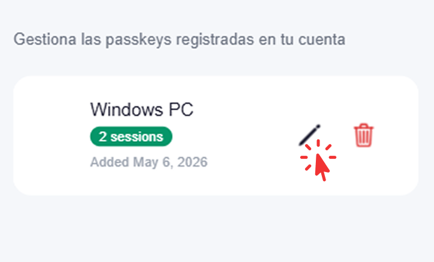
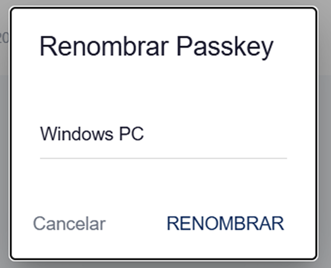
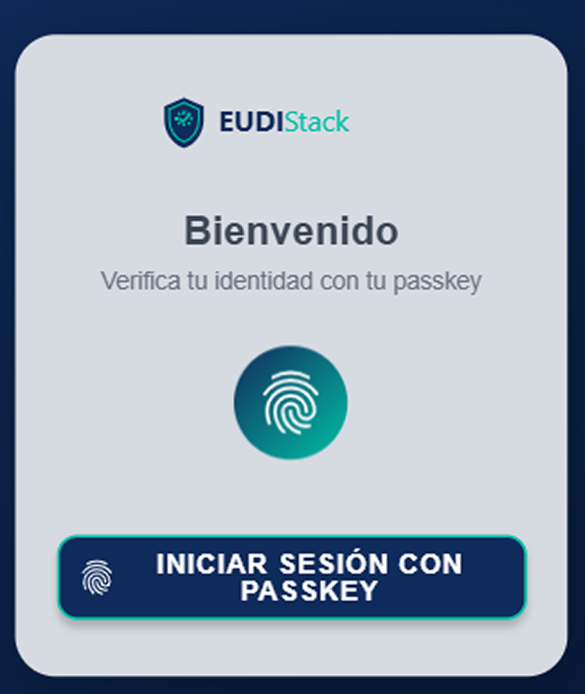
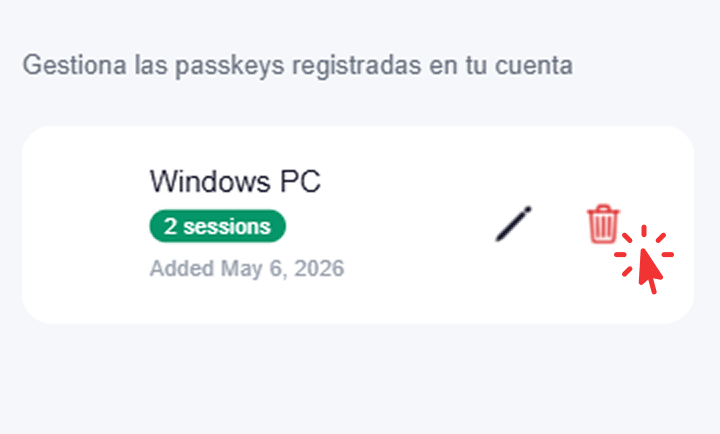
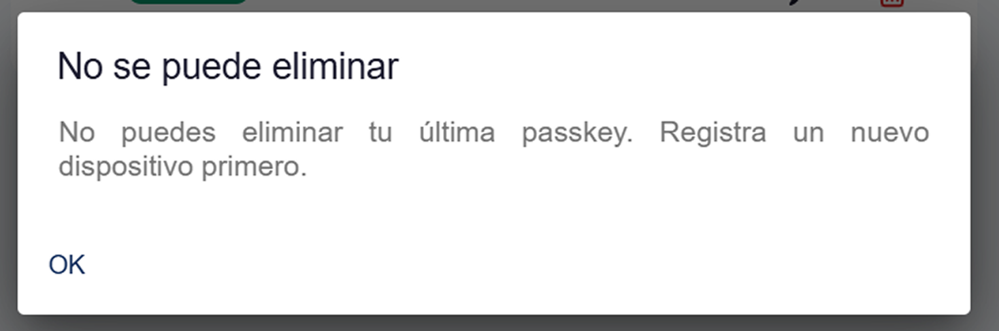

# Dispositivos y claves — Business Wallet

El Business Wallet permite operar desde varios dispositivos. Cada dispositivo se vincula con un passkey distinto.

## Sección Dispositivos

Disponible en **Ajustes → Mis Dispositivos**. 

{ width="320" }

{ width="320" }

Lista todos los passkeys vinculados a la cuenta con la siguiente información:

- Nombre del dispositivo.
- Sesiones activas.
- Fecha de registro.

## Acciones disponibles

Desde el detalle de cada dispositivo es posible:

- **Renombrar**: actualiza el nombre del dispositivo para facilitar su identificación. 

    Pulsar el icono de edición del dispositivo para acceder a la opción *Renombrar*.

    { width="320" }

    Introducir el nuevo nombre en el diálogo. El nombre se actualiza de forma inmediata.

    { width="240" }

- **Cerrar sesiones**: cierra todas las sesiones activas en ese dispositivo sin eliminar el passkey. El dispositivo seguirá registrado y podrá usarse para autenticarse de nuevo.

    Pulsar *Cerrar sesiones* para terminar todas las sesiones activas en el dispositivo.

    { width="320" }

    Para volver a acceder, autenticarse con el passkey del dispositivo.

    { width="320" }

    El acceso se confirma y es posible continuar utilizando el wallet desde el mismo dispositivo.

    { width="320" }

- **Eliminar**: borra el passkey y la vinculación del dispositivo. No será posible autenticarse desde ese dispositivo hasta volver a registrarlo.

    Pulsar el icono de eliminación del dispositivo. Al confirmar, se elimina el passkey y la vinculación del dispositivo. 

    { width="320" }

    Para volver a registrar el dispositivo, seguir los pasos de [Primeros pasos](getting-started.md).

!!! warning "Protección del último dispositivo"
    No es posible eliminar el último passkey registrado. Para dar de baja el dispositivo en uso, registrar primero un nuevo dispositivo desde **Ajustes → Mis Dispositivos**.

    { width="400" }

## Buenas prácticas

- Registrar al menos **dos dispositivos** (principal + respaldo) para evitar perder el acceso.
- Eliminar los dispositivos que ya no estén en uso (móvil antiguo, ordenador devuelto a la empresa).
