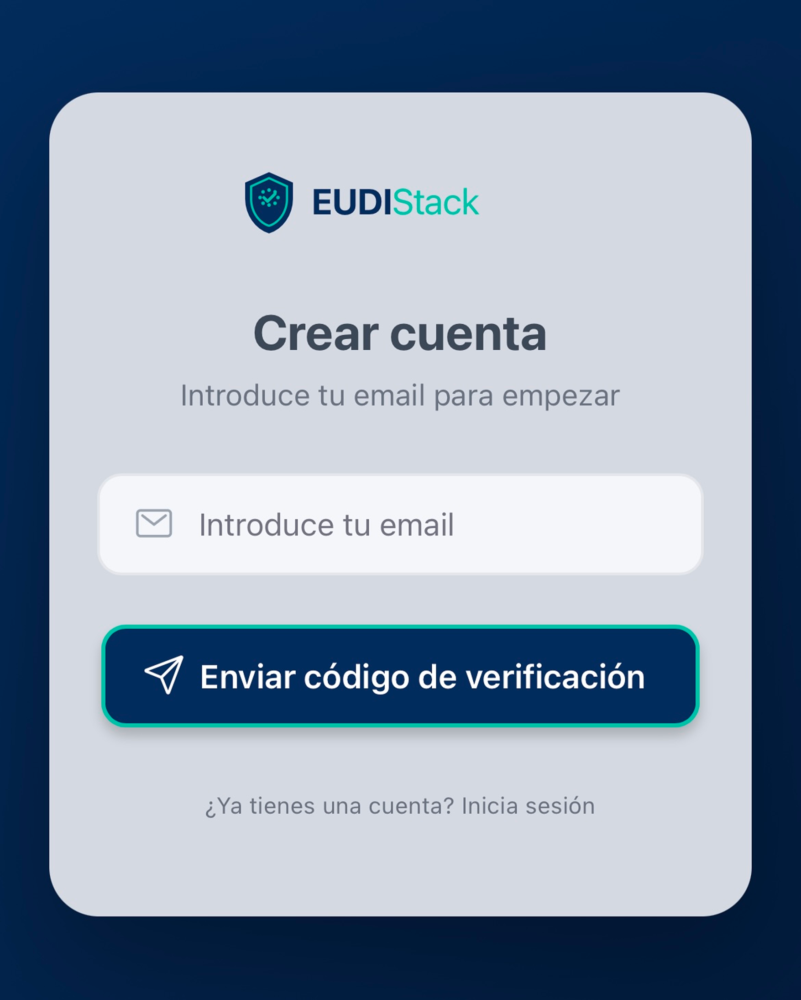
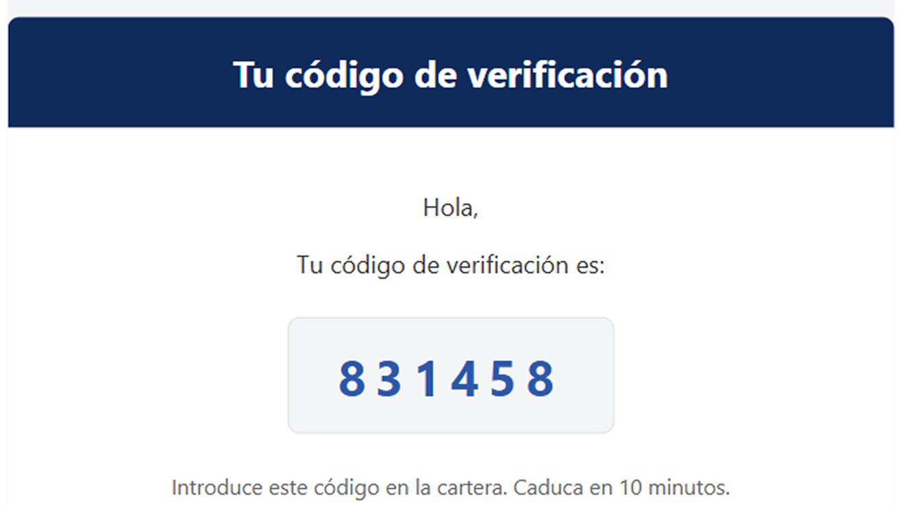
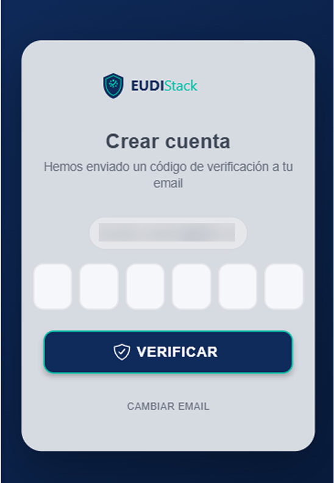
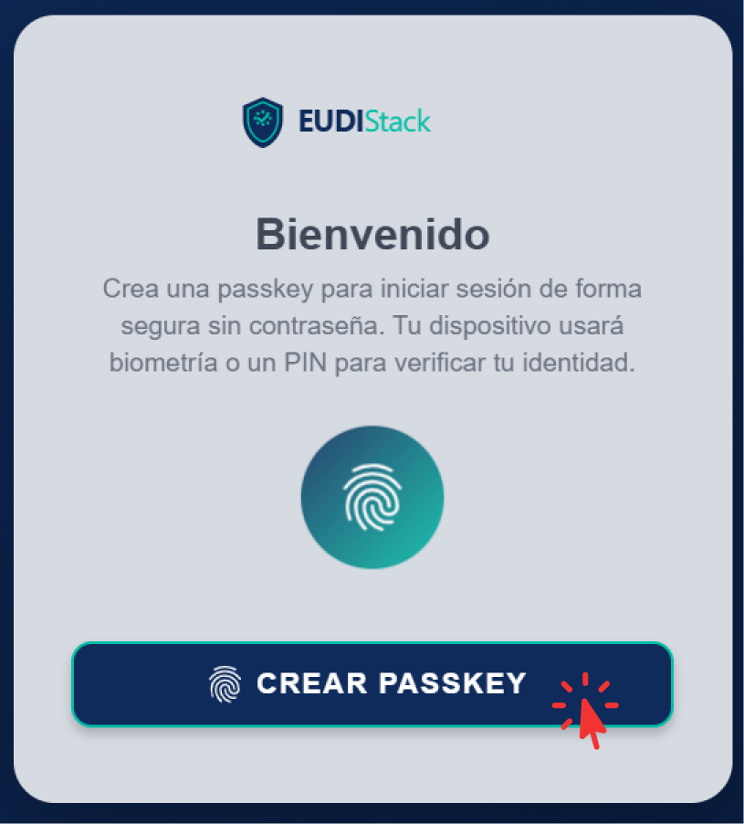
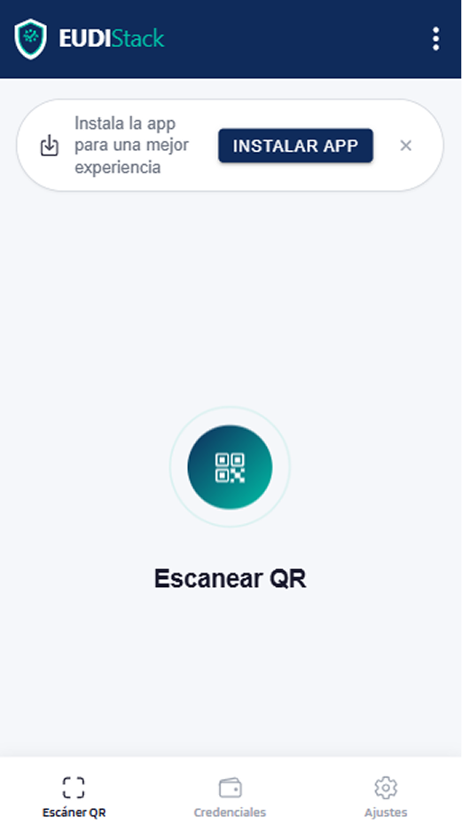

# Primeros pasos — Business Wallet

Primera activación del Business Wallet: verificación del email corporativo, creación del passkey y confirmación del acceso.

## Requisitos

- Dirección de email corporativa.
- Navegador moderno compatible con WebAuthn / Passkey (PRF).
- Conexión a internet.

## Pasos

1. **Acceder al Business Wallet**: navegar a la URL del wallet de la organización.

2. **Introducir el email corporativo**: el wallet solicita una dirección de correo para iniciar el alta.

    { width="320" }

3. **Verificar el código OTP <small>*(One-Time Password)*</small>**: el sistema envía un código de 6 dígitos al email introducido. Introducir el código en el wallet para confirmar la identidad y completar el alta de cuenta.

    <figure markdown style="margin-left: 0;">
      { width="400" }
      <figcaption> email - con código de 6 dígitos</figcaption>
    </figure>
    
    { width="320" }

4. **Crear el passkey**: el wallet solicita registrar un passkey con la biometría o PIN del dispositivo. El passkey vincula el dispositivo a la cuenta y permite el acceso futuro sin necesidad de repetir el proceso OTP <small>*(One-Time Password)*</small>.

    { width="320" }

5. **Acceso confirmado**: ya es posible recibir y presentar credenciales desde el Business Wallet.

    { width="320" }

## Siguiente paso

[Gestionar dispositivos →](devices.md)
