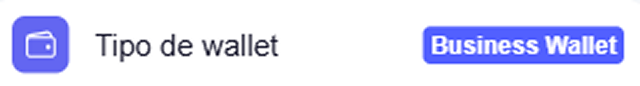

# Wallet — Business Wallet

The **European Business Wallet (EBW)** is the corporate user version of the wallet. Unlike the personal EUDIW, credentials are stored on the organisation's server and are accessible from multiple registered devices. Cryptographic keys are generated on the device using the passkey (biometrics or PIN) and never leave it.

!!! tip "How to identify the Business Wallet"
    In **Settings**, the **Wallet type** field shows the active mode: `Business Wallet`.

    { width="320" }

    Additionally, a **My Devices** section appears in Settings, which does not exist in the personal EUDIW.

    { width="320" }

## Key differences from EUDIW

| Feature | EUDIW (personal) | Business Wallet |
|---|---|---|
| Credential storage | Device browser | Organisation server |
| Cryptographic keys | User's device (passkey) | User's device (passkey) |
| Multi-device | No | Yes (device management) |
| Access from backup device | No | Yes |

## In this section

-   :material-rocket-launch: [**Getting started**](getting-started.md)

    Activate the account, verify the corporate email and create the passkey on the first device.

-   :material-key-chain: [**Devices and keys**](devices.md)

    Manage the authorised devices from which you can operate.

-   :material-briefcase-clock: [**Daily operations**](daily-operations.md)

    Receive and present credentials on behalf of the organisation.

