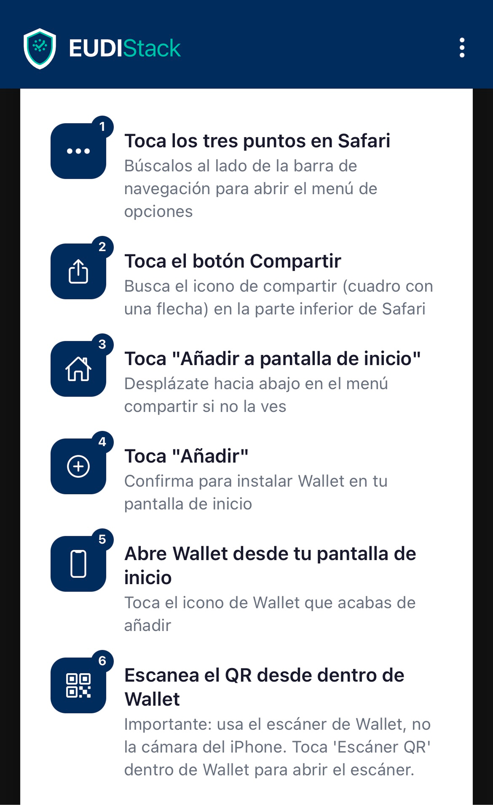
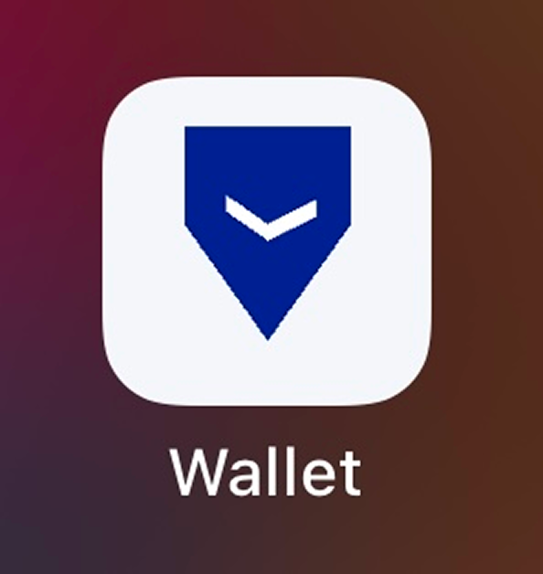
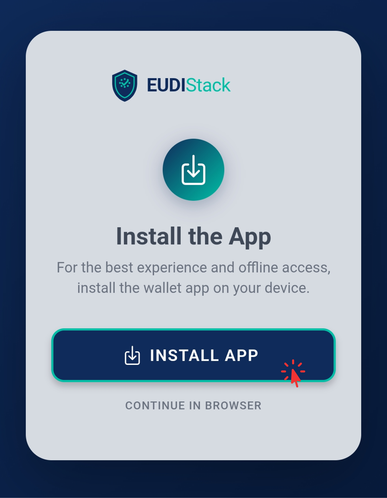
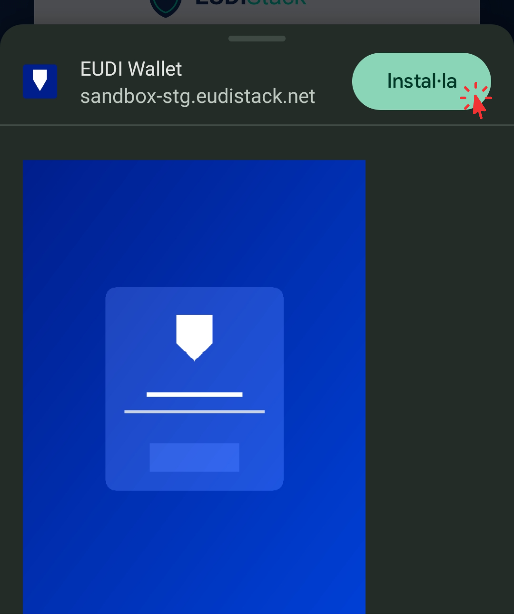
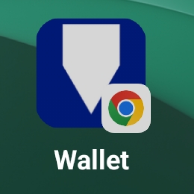
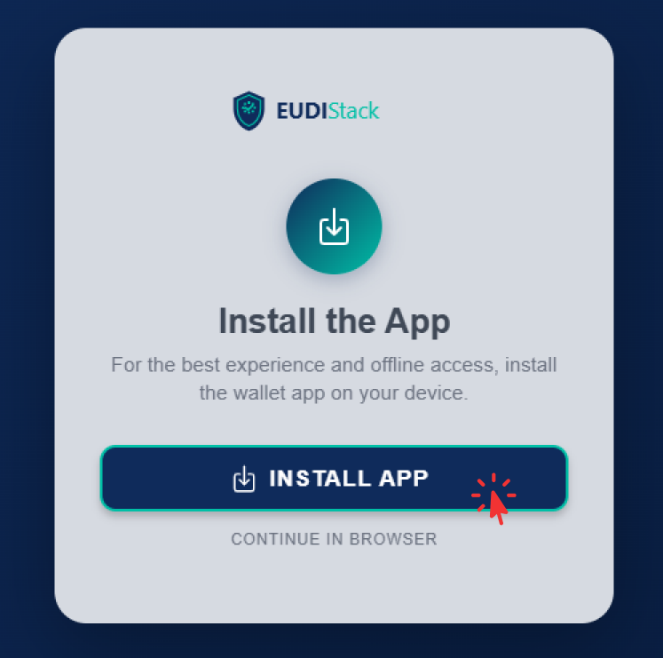
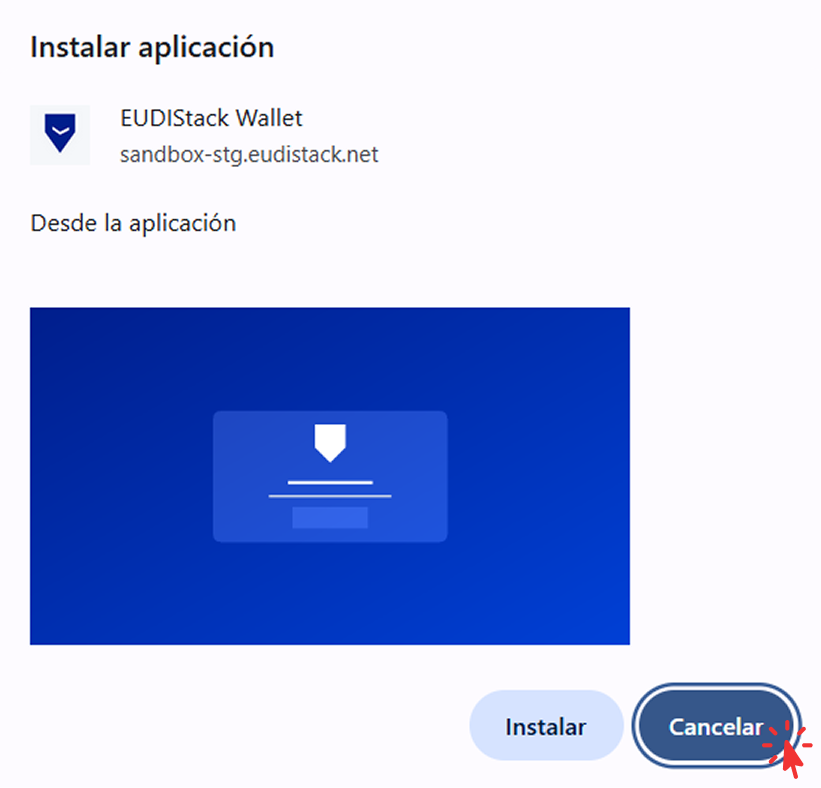
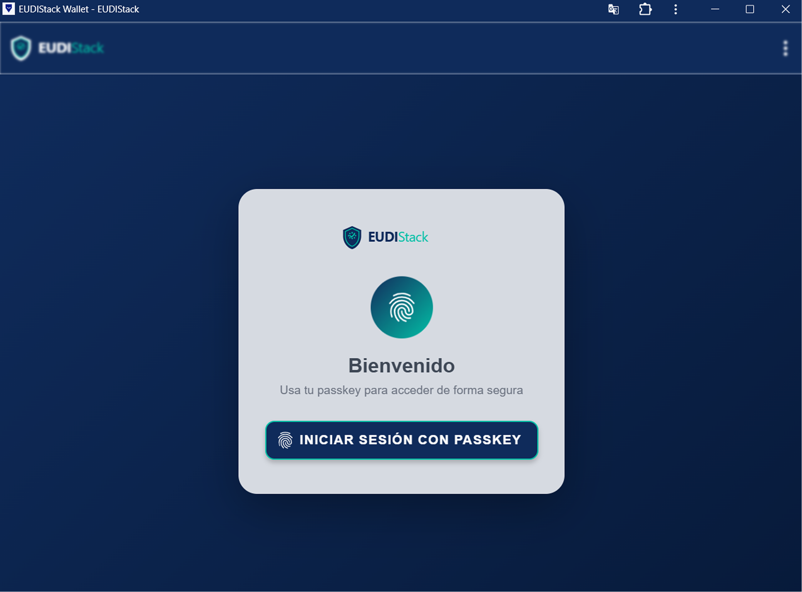
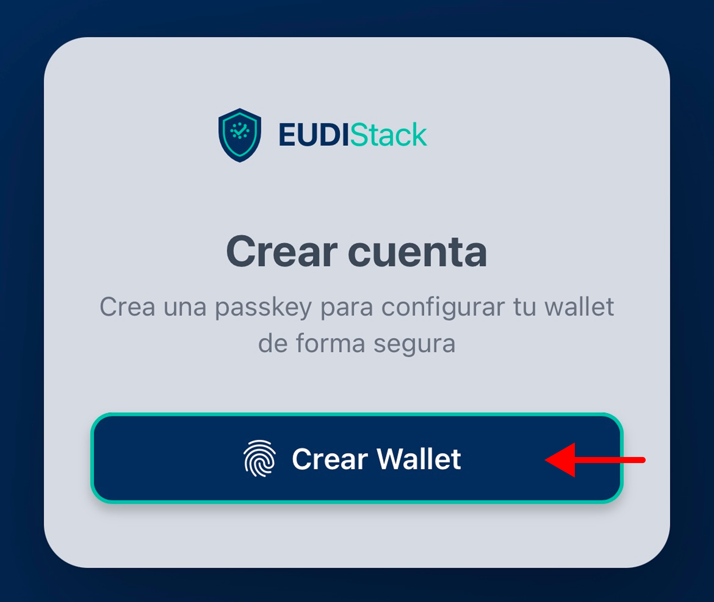
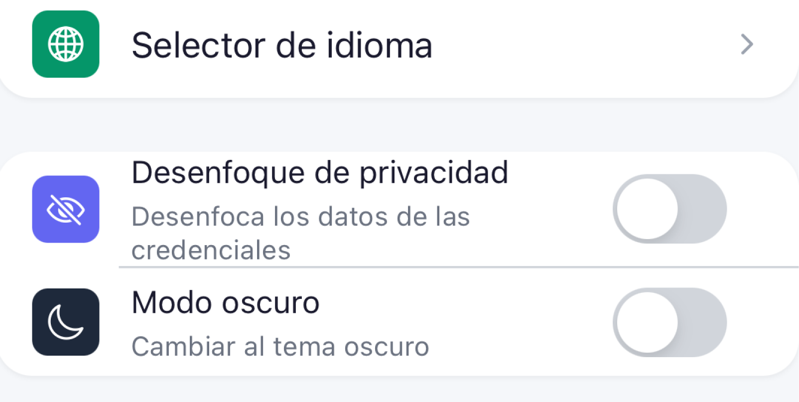

# Getting started — EUDIW

How to install the wallet on your device as an application, set up your access with fingerprint, facial recognition or PIN, and start using it.

---

## Requirements

- Modern browser (Chrome, Edge, Safari, up-to-date Firefox).
- Device with fingerprint, facial recognition or PIN.
- Internet connection for the initial registration.

---

## Steps

??? "1. Open the wallet"
    Navigate to the organization's wallet URL.

??? "2. Install as an application (optional)"
    The wallet offers to install the application on the device. Installing lets you access the wallet as a native app, without having to open the browser each time. It is possible to continue without installing.

    
    === "iOS (Safari)"
        When you open the wallet in Safari, the system automatically redirects to the installation screen. Follow the on-screen flow to complete the installation.

        { width="240" }

        { width="80" }

        ??? warning "Install the app before registering"
            Apple isolates the storage (credentials, session) of installed apps from Safari. If registration is done in Safari before installing the app, the data will be lost when installing and it will be necessary to register again. Always starting registration from the already installed app avoids this problem.
        
    === "Android (Chrome)"
        When you open the wallet, an installation button appears on screen. Tap it and install the application.

        { width="240" }

        { width="240" }

        { width="80" }

    === "Desktop (Chrome)"
        When you open the wallet, an installation button appears on screen. Tap it and install the application; it will automatically open as an app independent of the browser.

        { width="240" }

        { width="320" }

        { width="400" }

    ??? info "Install from Settings"
        It is also possible to install the application from **Settings** at any time.
        
        { width="160" }

??? "3. Create the passkey"
    The wallet will ask you to create a passkey — the digital key that protects your access. Use your fingerprint, facial recognition or your device's PIN.

    { width="240" }

??? "4. Access confirmed"
    You can now receive and present credentials from the wallet.

---

??? info "Optional settings"
    From **[Settings](../wallet-eudiw/settings.md)** it is possible to configure the language, dark mode and privacy blur at any time, without having to repeat registration.

    { width="320" }

## Next step

[Receive your first credential →](receive-credentials.md)
