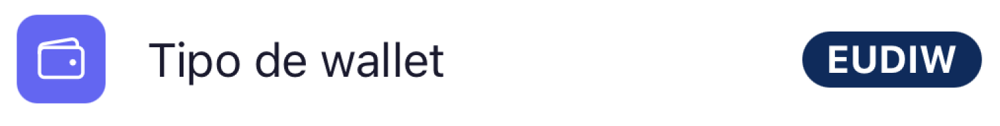

# Wallet — EUDIW

EUDIW (European Digital Identity Wallet) es la versión **personal** del wallet de EUDIStack. Las claves criptográficas y las credenciales se generan y almacenan **en el dispositivo** (modo *Browser*), protegidas con passkey/biometría.

!!! tip "¿Cómo sé que estoy en EUDIW?"
    Abrir **Ajustes**. En el campo **Tipo de wallet** aparece el modo activo: `EUDIW` corresponde al wallet personal y `Business Wallet` al organizacional.
    
    { width="320" }

## En esta sección

-   :material-rocket-launch: [**Primeros pasos**](getting-started.md)

    Instalar el wallet, configurar el passkey y preparar el dispositivo.

-   :material-download: [**Recibir credenciales**](receive-credentials.md)

    Cómo aceptar una credencial emitida por un Issuer.

-   :material-share: [**Presentar credenciales**](present-credentials.md)

    Cómo compartir credenciales con un [Verifier](../verifier/index.md) de forma selectiva.

    <small>Un Verifier es un servicio o portal que solicita y valida credenciales, por ejemplo,
    para verificar la identidad de un usuario, permitirle iniciar sesión o acreditar
    determinados atributos.</small>

-   :material-folder-account: [**Gestionar credenciales**](manage-credentials.md)

    Ver y eliminar credenciales del wallet.

