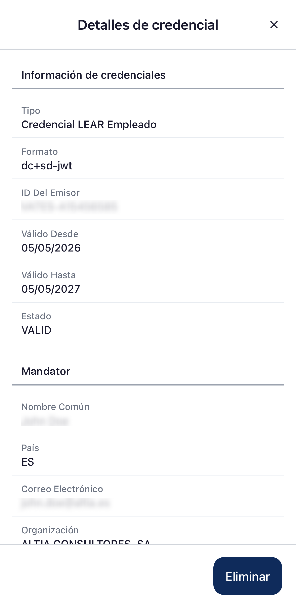
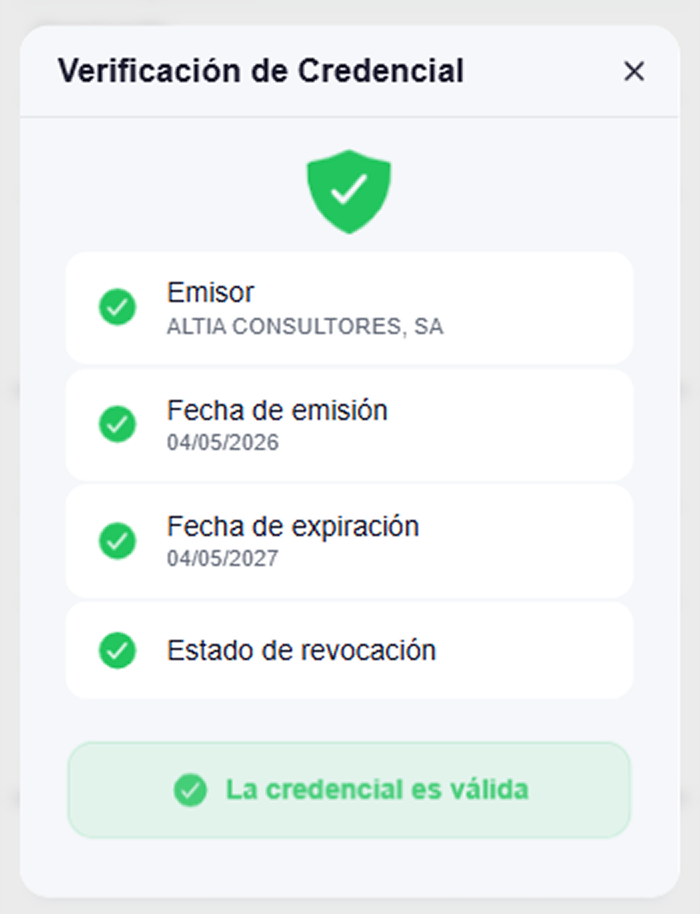
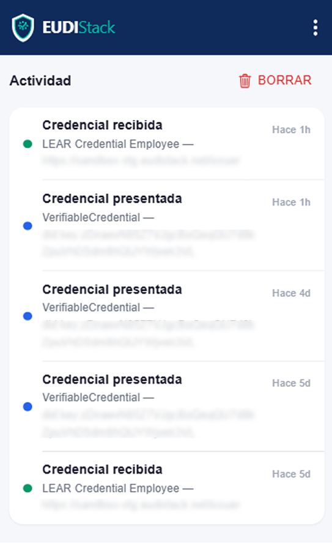

# Gestionar credenciales — EUDIW

Cómo consultar y eliminar credenciales del wallet.

## Pestaña Credenciales

Lista todas las credenciales activas con:

- Tipo de credencial.
- Emisor.
- Estado (VÁLIDO, EXPIRADO, REVOCADO).
- Fecha de emisión y caducidad.

## Acciones

- **Ver detalles**: muestra todos los atributos de la credencial.

    { width="240" }
    
- **Verificar credencial**: comprueba la validez de la credencial en el momento. Muestra el emisor, la fecha de emisión, la fecha de expiración y el estado de revocación.

    { width="240" }

- **Eliminar**: borra la credencial localmente (no la revoca en el emisor).

## Actividad

Acceder desde **Ajustes → Actividad**. Lista cada presentación enviada y cada credencial recibida, con timestamp e issuer/verifier asociado.

<figure markdown style="display: table; margin-left: 0;">
{ width="320" }
</figure>

<figure markdown style="display: table; margin-left: 0;">
{ width="240" }
</figure>
