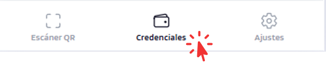
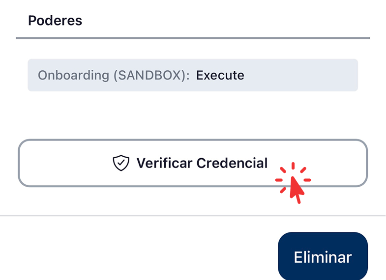
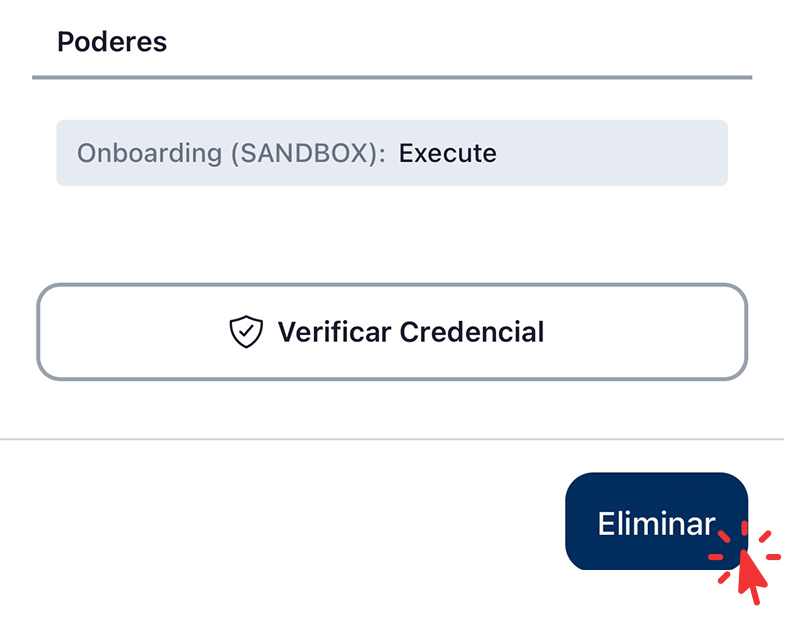

# Gestionar credenciales — EUDIW

Cómo consultar y eliminar credenciales del wallet.

## Cómo acceder a las credenciales

Pulsar la pestaña *Credenciales* en la barra de navegación inferior.

{ width="240" }

## Lista de Credenciales 

Lista todas las credenciales activas con:

- Tipo de credencial.
- Emisor.
- Estado:

    - **VÁLIDO**: la credencial está vigente y puede utilizarse para presentaciones.
    - **EXPIRADO**: la credencial ha superado su fecha de caducidad y no puede presentarse.
    - **REVOCADO**: el emisor ha invalidado la credencial; no puede utilizarse para presentaciones.

- Fecha de emisión y caducidad.

{ width="240" }

## Acciones

- **Ver detalles**: pulsar la tarjeta de una credencial para mostrar todos sus atributos.

    { width="240" }
    
- **Verificar credencial**: comprueba la validez de la credencial en el momento. Muestra el emisor, la fecha de emisión, la fecha de expiración y el estado de revocación. El botón se encuentra en la parte inferior de la pantalla de detalles de la credencial.

    { width="240" }

    { width="240" }

- **Eliminar**: borra la credencial localmente (no la revoca en el emisor). El botón se encuentra en la parte inferior de la pantalla de detalles de la credencial.

    { width="240" }

## Actividad

Acceder desde **Ajustes → Actividad**. Lista cada presentación enviada y cada credencial recibida, con timestamp e issuer/verifier asociado.

<figure markdown style="display: table; margin-left: 0;">
{ width="320" }
</figure>

<figure markdown style="display: table; margin-left: 0;">
{ width="240" }
</figure>
