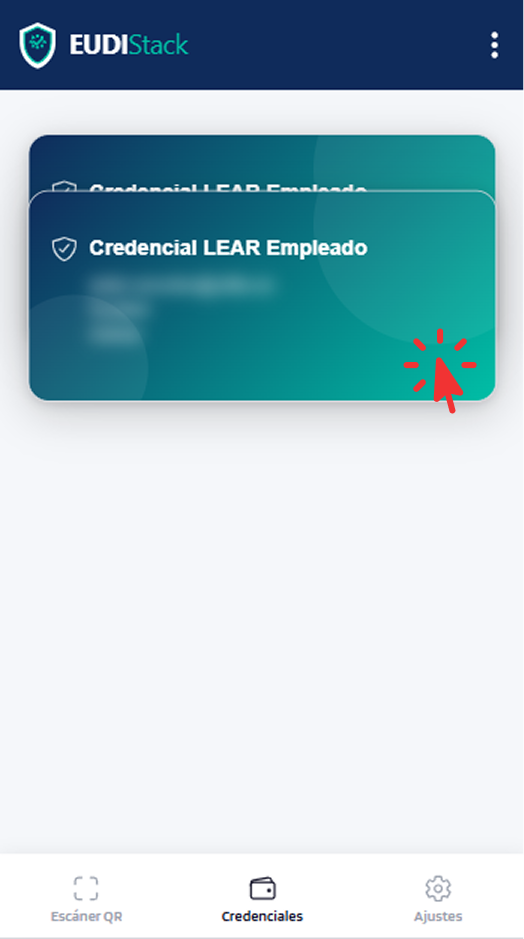

# Gestionar credenciales

Cómo consultar y eliminar credenciales del wallet.

---

## Cómo acceder a las credenciales

Pulsar la pestaña *Credenciales* en la barra de navegación inferior.

{ width="240" }

---

## Lista de Credenciales

??? "Ver listado"
    Lista todas las credenciales activas con:

    - Tipo de credencial.
    - Emisor.
    - Estado:

        - **VÁLIDO**: la credencial está vigente y puede utilizarse para presentaciones.
        - **EXPIRADO**: la credencial ha superado su fecha de caducidad y no puede presentarse.
        - **REVOCADO**: el emisor ha invalidado la credencial; no puede utilizarse para presentaciones.

    - Fecha de emisión y caducidad.

    { width="240" }

---

## Acciones

??? "Ver detalles de una credencial"
    Pulsar la tarjeta de una credencial para mostrar todos sus atributos.

    { width="240" }

    { width="240" }

??? "Verificar credencial"
    Comprueba la validez de la credencial en el momento. Muestra el emisor, la fecha de emisión, la fecha de expiración y el estado de revocación. El botón se encuentra en la parte inferior de la pantalla de detalles de la credencial.

    { width="240" }

    { width="240" }

??? "Eliminar una credencial"
    El botón **Eliminar** se encuentra en la parte inferior de la pantalla de detalles. Elimina la credencial del wallet de forma permanente.

    { width="240" }

    !!! warning "Esta acción no se puede deshacer"
        Si necesitas volver a usarla, deberás solicitarla de nuevo al emisor.

---

## Actividad

El historial de presentaciones y recepciones se consulta en **[Ajustes → Actividad](settings.md#actividad)**.
