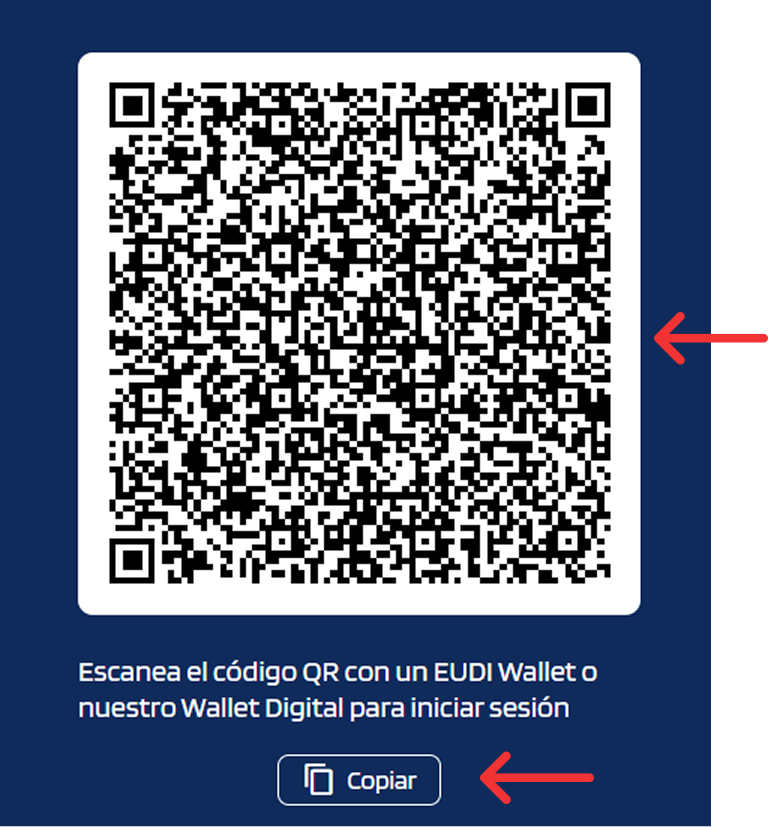
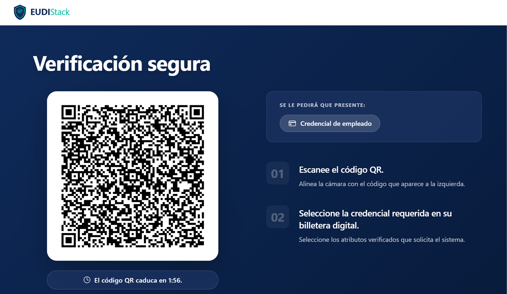
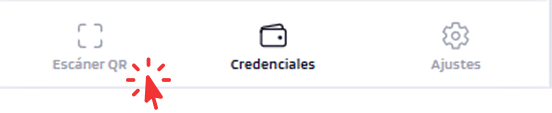
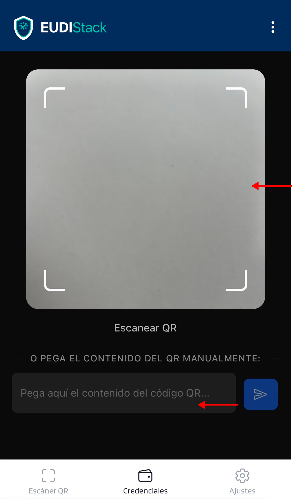
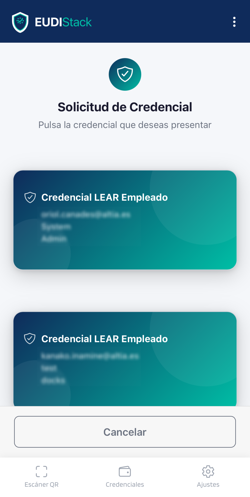
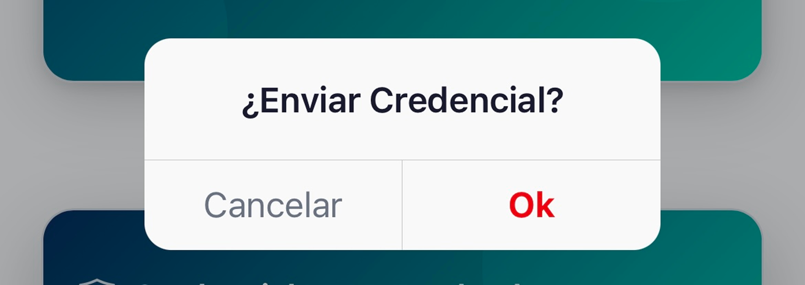

# Presentar credenciales

Un Verifier es un servicio o portal que solicita y valida credenciales, por ejemplo, para verificar la identidad de un usuario, permitirle iniciar sesión o acreditar determinados atributos.

---

## Pasos

??? "1. El Verifier presenta una solicitud (QR o URL)"
    El Verifier muestra un código QR o una URL para iniciar el proceso de verificación.

    **Ejemplo 1:**

    { width="240" }

    **Ejemplo 2:**

    { width="480" }

??? "2. Escanear el QR con el wallet o usar URL"
    Pulsar la pestaña *Escaneo QR* en la barra de navegación inferior.

    { width="240" }

    **Opción A — Escaneo QR:** apuntar la cámara al código QR del Verifier.

    **Opción B — URL manual:** pegar la URL directamente en el campo de texto de la misma pantalla.

    { width="240" }

??? "3. El Wallet muestra las credenciales que coincide con la solicitud"
    { width="240" }

??? "4. Seleccionar la credencial a presentar"
    pulsar la tarjeta correspondiente.

??? "5. El wallet firma y envía la presentación"
    el dispositivo solicita autenticación (passkey o biometría) como parte del proceso de firma.

    { width="240" }
---

## Privacidad

- Solo se envía lo que se confirma.
- El wallet registra cada presentación en *Actividad*, accesible desde **Ajustes → Actividad**.
- Es posible denegar la presentación sin penalización. Si se desea reintentar, escanear de nuevo el QR o enlace del Verifier; en algunos casos puede ser necesario solicitar uno nuevo.
