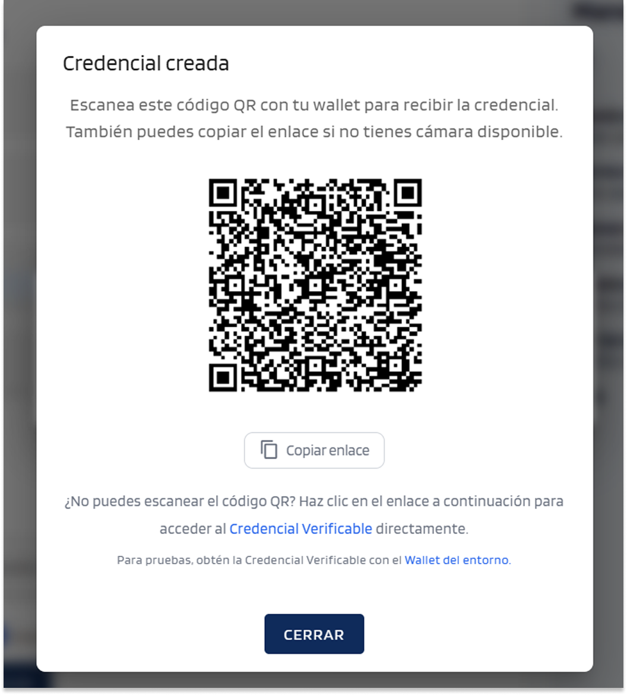
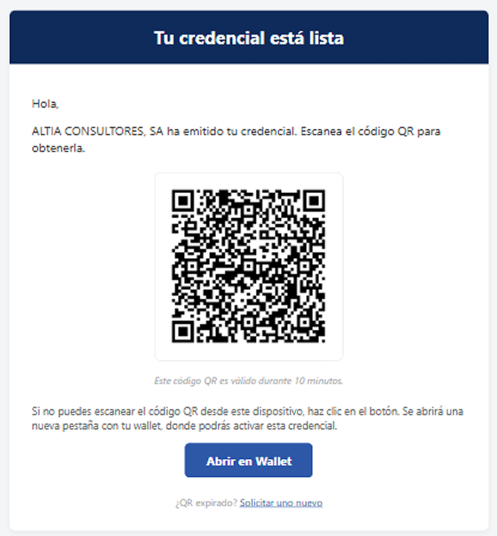
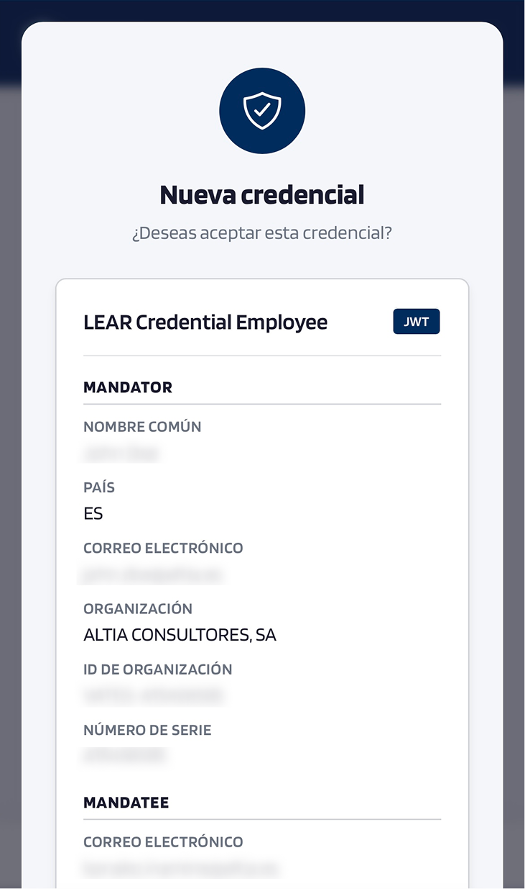
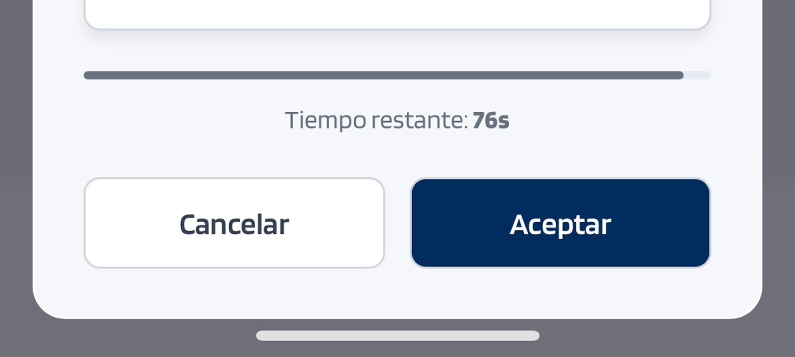
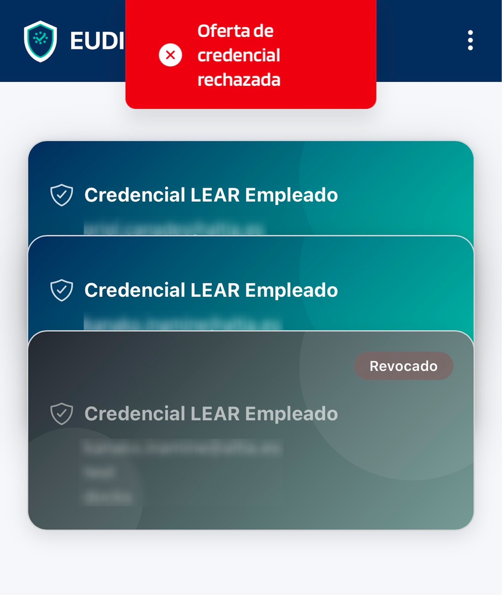
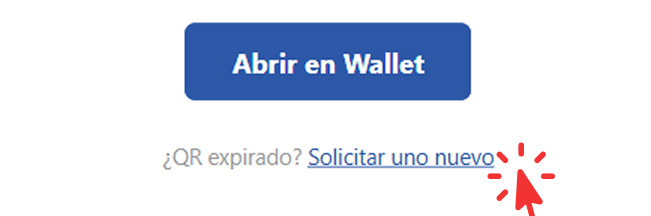
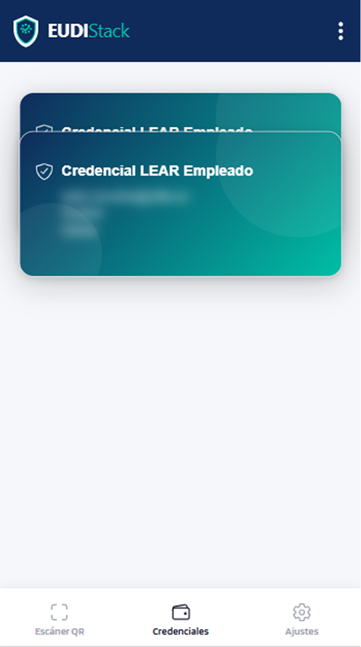

# Recibir credenciales — EUDIW

Cómo aceptar una credencial verificable emitida por un Issuer.

## Métodos disponibles

- **Escaneo de QR**: el Issuer presenta un QR en pantalla; escanearlo desde el wallet.
- **Por email**: se recibe un correo con un código QR y un botón *Abrir en Wallet*; escanear el QR o pulsar el botón para añadir la credencial al wallet.

## Pasos

1. **Recibir la oferta**: desde el portal del Issuer (QR en pantalla) o por email (con QR y botón *Abrir en Wallet*).

    <figure markdown style="display: table; margin-left: 0;">
      { width="320" }
      <figcaption>Portal del Issuer — QR en pantalla</figcaption>
    </figure>

    <figure markdown style="display: table; margin-left: 0;">
      { width="320" }
      <figcaption>Correo — QR y botón Abrir en Wallet</figcaption>
    </figure>

    !!! info "Validez del QR"
        - **QR en pantalla**: válido durante **10 minutos** desde que aparece en pantalla.
        - **QR por email**: válido durante **10 minutos** desde el momento del envío,
          no desde que se abre el correo. Si el correo tarda en llegar o se abre
          más tarde, el tiempo disponible puede ser menor.

          Si el QR ha expirado, usar el enlace **Solicitar uno nuevo** del correo.

    Para escanear el QR desde el wallet: pulsar la pestaña *Escaneo QR* en la barra de navegación inferior.

    { width="240" }

    Apuntar la cámara al código QR. También es posible la URL manualmente en el campo de texto.

    { width="240" }

2. **El wallet muestra la oferta**: el wallet muestra el emisor, el tipo de credencial y los atributos incluidos. En la parte inferior aparece un temporizador de cuenta regresiva: pulsar **Aceptar** antes de que expire.

    { width="320" }

    !!! warning "La credencial no se añade si se cancela o expira el tiempo"
        Si se pulsa **Cancelar** o el temporizador llega a cero sin confirmar, la oferta se rechaza y la credencial no se almacena en el wallet.
        
        { width="320" }

        { width="320" }

        Si el tiempo expira, pulsar el enlace **Solicitar uno nuevo** del correo recibido: el sistema reenvía el correo de oferta desde el que es posible **escanear el QR** o pulsar **Abrir en Wallet** de nuevo.

        { width="320" }

3. **Confirmar con el passkey del dispositivo**: tras la confirmación, la credencial se almacena en el wallet.

4. **La credencial aparece en la pestaña *Credenciales***.

    { width="320" }

## Errores comunes

Consulta [solución de problemas](../troubleshooting.md) si la oferta no se abre, el QR no escanea o aparece un error tras la confirmación.
