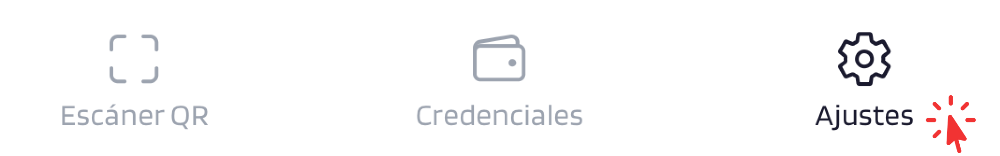
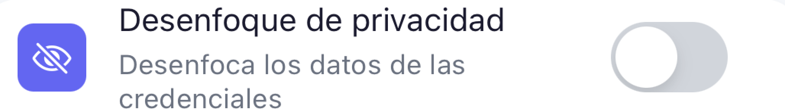
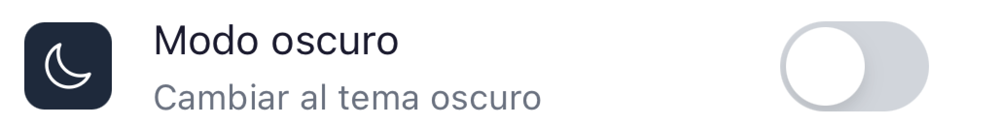
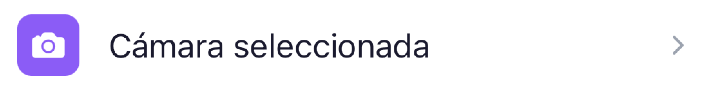
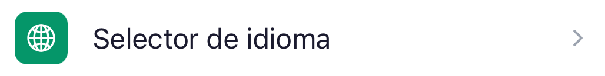
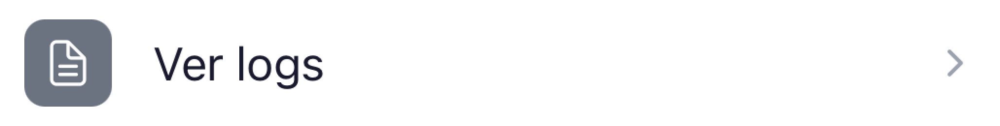
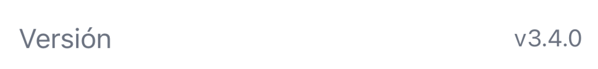

# Ajustes

Accesible desde la pestaña *Ajustes* en la barra de navegación inferior.

{ width="240" }

Desde aquí es posible consultar el historial de actividad, personalizar la apariencia y el idioma, gestionar la cámara para el escaneo de QR y acceder a recursos de soporte.

---

??? "Actividad"
    Historial de operaciones realizadas con el wallet. Lista cada credencial recibida, presentada o eliminada, con timestamp e issuer/verifier asociado.

    { width="320" }

    { width="240" }

??? "Desenfoque de privacidad"
    Desenfoca los datos de las credenciales en las vistas de lista y detalle. Útil para proteger información sensible en entornos públicos.

    **Predeterminado:** desactivado.

    { width="240" }

??? "Modo oscuro"
    Cambia el tema de la aplicación entre el modo claro y el modo oscuro.

    **Predeterminado:** desactivado (tema claro).

    { width="240" }

---

??? "Cámara seleccionada"
    Permite elegir qué cámara del dispositivo se utiliza para escanear códigos QR. Muestra una vista previa en tiempo real de la cámara seleccionada.

    { width="240" }

??? "Selector de idioma"
    Permite cambiar el idioma de la aplicación. El idioma seleccionado se guarda y se aplica en todas las sesiones.

    Idiomas disponibles: **Castellano**, **English**, **Català**.

    { width="240" }

---

??? "Base de conocimiento"
    Enlace a la documentación oficial y recursos de ayuda.

    { width="240" }

??? "Ver logs"
    Muestra los registros de errores de cámara recogidos durante el uso de la aplicación. Visible en ambos tipos de wallet cuando está habilitado por la configuración del entorno.

    { width="240" }

??? "Enviar logs"
    Esta función solo es visible para algunos clientes.

    { width="240" }

??? "Mis Dispositivos <small>— solo Business Wallet</small>"
    Gestiona los dispositivos vinculados a la cuenta. Disponible únicamente en el Business Wallet.

    { width="240" }

    → Ver [Dispositivos y claves](../wallet-business/devices.md)

---

??? "Tipo de wallet"
    Indica el modo de funcionamiento del wallet:

    - **EUDIW**: wallet personal. Las credenciales se almacenan localmente en el dispositivo.

        { width="320" }

    - **Business Wallet**: wallet para usuarios corporativos. Las credenciales se almacenan en el servidor de la organización.

        { width="320" }

??? "Versión"
    Número de versión actual de la aplicación. Solo informativo.

    { width="320" }
